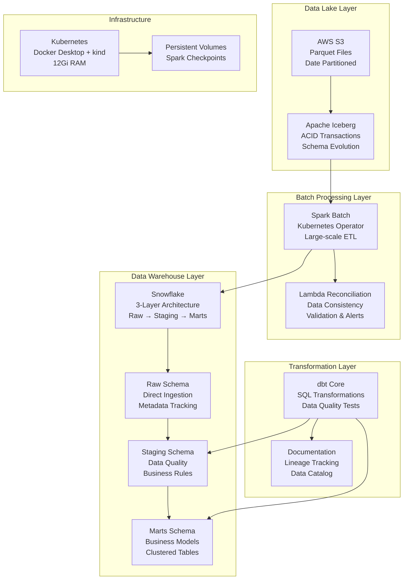

# Batch Analytics Layer - Design Document

## Overview

This document describes the design for a comprehensive batch analytics layer that processes data from AWS S3 using Apache Iceberg, Spark batch processing, and loads results into Snowflake for business intelligence. The system includes dbt transformations for creating business-ready data marts and ensures eventual consistency with the speed layer through Lambda reconciliation.

The data being processed originates from PostgreSQL e-commerce database tables (users, products, orders, order_items) that flow through the data ingestion pipeline via Change Data Capture (CDC) to S3 as Parquet files, which are then processed by this batch analytics layer to create comprehensive business intelligence and reporting capabilities.

The architecture follows Lambda Architecture principles with focus on accuracy and completeness:
- **Data Lake Processing**: Apache Iceberg on S3 for ACID transactions and schema evolution
- **Batch Processing**: Spark batch jobs for large-scale data transformation
- **Data Warehousing**: Snowflake with 3-layer architecture (Raw, Staging, Marts)
- **Transformations**: dbt for SQL-based business logic and data modeling
- **Reconciliation**: Automated consistency validation between speed and batch layers

## Architecture

### High-Level Architecture Diagram



### Data Flow Architecture

#### Batch Processing Flow
1. **Data Lake Reading**: Spark reads PostgreSQL-sourced Parquet files from S3 using Iceberg table format
2. **Data Transformation**: Complex aggregations and business logic applied to e-commerce data at scale
3. **Quality Validation**: Comprehensive data quality checks and business rule validation for PostgreSQL table structures
4. **Warehouse Loading**: Processed data loaded into Snowflake Raw schema with metadata
5. **dbt Transformations**: SQL-based transformations create Staging and Marts schemas from e-commerce source data

#### Reconciliation Flow
1. **Data Extraction**: Extract comparable datasets from ClickHouse and Snowflake
2. **Data Alignment**: Align PostgreSQL integer IDs between speed and batch layers
3. **Consistency Validation**: Compare business metrics and transaction data
4. **Discrepancy Reporting**: Alert on data inconsistencies with detailed analysis
5. **Convergence Tracking**: Monitor eventual consistency convergence timing

## Components and Interfaces

### Apache Spark (Batch Processing Engine)

**Purpose**: Large-scale batch processing and ETL operations
**Configuration**:
```yaml
spark:
  driver:
    resources:
      requests: { memory: "2Gi", cpu: "1000m" }
      limits: { memory: "3Gi", cpu: "1500m" }
  executor:
    instances: 2
    resources:
      requests: { memory: "3Gi", cpu: "1500m" }
      limits: { memory: "4Gi", cpu: "2000m" }
  config:
    spark.sql.adaptive.enabled: "true"
    spark.sql.adaptive.coalescePartitions.enabled: "true"
    spark.sql.adaptive.skewJoin.enabled: "true"
    spark.serializer: "org.apache.spark.serializer.KryoSerializer"
    spark.sql.extensions: "org.apache.iceberg.spark.extensions.IcebergSparkSessionExtensions"
    spark.sql.catalog.spark_catalog: "org.apache.iceberg.spark.SparkSessionCatalog"
    spark.sql.catalog.spark_catalog.type: "hive"
    spark.sql.catalog.iceberg: "org.apache.iceberg.spark.SparkCatalog"
    spark.sql.catalog.iceberg.type: "hadoop"
    spark.sql.catalog.iceberg.warehouse: "s3://data-s3-bucket/"
```

**Batch Job Structure**:
```scala
object BatchAnalyticsApp extends App {
  val spark = SparkSession.builder()
    .appName("EcommerceBatchAnalytics")
    .config("spark.sql.extensions", "org.apache.iceberg.spark.extensions.IcebergSparkSessionExtensions")
    .config("spark.sql.catalog.iceberg", "org.apache.iceberg.spark.SparkCatalog")
    .config("spark.sql.catalog.iceberg.type", "hadoop")
    .config("spark.sql.catalog.iceberg.warehouse", "s3://data-s3-bucket/")
    .getOrCreate()
  
  import spark.implicits._
  
  // Read from Iceberg tables (PostgreSQL source data)
  val users = spark.read
    .format("iceberg")
    .load("iceberg.ecommerce.users")
    .filter(col("date") >= lit(args(0))) // Process specific date range
  
  val products = spark.read
    .format("iceberg")
    .load("iceberg.ecommerce.products")
    .filter(col("date") >= lit(args(0)))
    
  val orders = spark.read
    .format("iceberg")
    .load("iceberg.ecommerce.orders")
    .filter(col("date") >= lit(args(0)))
    
  val orderItems = spark.read
    .format("iceberg")
    .load("iceberg.ecommerce.order_items")
    .filter(col("date") >= lit(args(0)))
  
  // Complex business logic transformations from e-commerce data
  val customerMetrics = calculateCustomerMetrics(users, orders, orderItems)
  val productAnalytics = calculateProductAnalytics(products, orderItems)
  val dailyBusinessMetrics = calculateDailyBusinessMetrics(users, orders, orderItems, products)
  
  // Write to Snowflake Raw tables (PostgreSQL mirror tables are loaded via direct ingestion)
  // Spark processes and writes derived analytics to staging for dbt consumption
  writeToSnowflake(users, "raw.users")
  writeToSnowflake(products, "raw.products") 
  writeToSnowflake(orders, "raw.orders")
  writeToSnowflake(orderItems, "raw.order_items")
  
  spark.stop()
}

def calculateCustomerMetrics(users: DataFrame, orders: DataFrame, orderItems: DataFrame): DataFrame = {
  // Join users with their orders and order items for customer analytics
  val customerOrders = users
    .join(orders, users("id") === orders("user_id"), "left")
    .join(orderItems, orders("id") === orderItems("order_id"), "left")
  
  customerOrders
    .groupBy("id", "email", "first_name", "last_name")
    .agg(
      count("order_id").as("total_orders"),
      sum("total_amount").as("total_spent"),
      avg("total_amount").as("avg_order_value"),
      max("orders.created_at").as("last_order_date"),
      min("orders.created_at").as("first_order_date"),
      countDistinct("product_id").as("unique_products_purchased"),
      sum("quantity").as("total_items_purchased")
    )
    .withColumn("loaded_at", current_timestamp())
    .withColumn("batch_id", lit(java.util.UUID.randomUUID().toString))
}
```

### Apache Iceberg (Data Lake Table Format)

**Purpose**: ACID transactions and schema evolution for data lake
**Configuration**:
```yaml
iceberg:
  catalog_type: "hadoop"
  warehouse_location: "s3://data-s3-bucket/"
  file_format: "parquet"
  compression: "snappy"
  table_properties:
    write.parquet.compression-codec: "snappy"
    write.metadata.compression-codec: "gzip"
    write.target-file-size-bytes: "134217728"  # 128MB
    commit.retry.num-retries: "4"
    commit.retry.min-wait-ms: "100"
```

**Table Definitions**:
The Iceberg tables mirror the PostgreSQL e-commerce tables (users, products, orders, order_items) that have been ingested via CDC and stored as Parquet files in S3.

```sql
-- Users table (mirrors PostgreSQL users table)
CREATE TABLE iceberg.ecommerce.users (
    id long,
    email string,
    first_name string,
    last_name string,
    created_at timestamp,
    updated_at timestamp,
    __op string,
    __ts_ms timestamp,
    __source_ts_ms timestamp,
    __source_lsn long,
    date date
) USING iceberg
PARTITIONED BY (date)
TBLPROPERTIES (
    'write.target-file-size-bytes'='134217728',
    'write.parquet.compression-codec'='snappy'
);

-- Products table (mirrors PostgreSQL products table)
CREATE TABLE iceberg.ecommerce.products (
    id long,
    name string,
    description string,
    price decimal(10,2),
    stock_quantity int,
    category string,
    created_at timestamp,
    updated_at timestamp,
    __op string,
    __ts_ms timestamp,
    __source_ts_ms timestamp,
    __source_lsn long,
    date date
) USING iceberg
PARTITIONED BY (date)
TBLPROPERTIES (
    'write.target-file-size-bytes'='134217728',
    'write.parquet.compression-codec'='snappy'
);

-- Orders table (mirrors PostgreSQL orders table)
CREATE TABLE iceberg.ecommerce.orders (
    id long,
    user_id bigint,
    status string,
    total_amount decimal(10,2),
    shipping_address string,
    created_at timestamp,
    updated_at timestamp,
    __op string,
    __ts_ms timestamp,
    __source_ts_ms timestamp,
    __source_lsn long,
    date date
) USING iceberg
PARTITIONED BY (date)
TBLPROPERTIES (
    'write.target-file-size-bytes'='134217728',
    'write.parquet.compression-codec'='snappy'
);

-- Order items table (mirrors PostgreSQL order_items table)
CREATE TABLE iceberg.ecommerce.order_items (
    id long,
    order_id long,
    product_id long,
    quantity int,
    unit_price decimal(10,2),
    created_at timestamp,
    __op string,
    __ts_ms timestamp,
    __source_ts_ms timestamp,
    __source_lsn long,
    date date
) USING iceberg
PARTITIONED BY (date)
TBLPROPERTIES (
    'write.target-file-size-bytes'='134217728',
    'write.parquet.compression-codec'='snappy'
);
```

### Snowflake (Data Warehouse)

**Purpose**: Comprehensive data warehouse with 3-layer architecture
**Configuration**:
```yaml
snowflake:
  account: "your-account.snowflakecomputing.com"
  warehouse: "COMPUTE_WH"
  warehouse_size: "SMALL"
  auto_suspend: 300  # 5 minutes
  auto_resume: true
  database: "ECOMMERCE_DW"
  role: "TRANSFORMER"
```

**3-Layer Schema Architecture**:

**Raw Schema - Direct Data Ingestion**:
```sql
-- Raw schema mirrors PostgreSQL source table structures
CREATE SCHEMA raw;

-- Raw users table (mirrors PostgreSQL users table)
CREATE TABLE raw.users (
    id NUMBER,
    email STRING,
    first_name STRING,
    last_name STRING,
    created_at TIMESTAMP_NTZ,
    updated_at TIMESTAMP_NTZ,
    
    -- CDC metadata fields
    __op STRING,  -- INSERT, UPDATE, DELETE
    __ts_ms TIMESTAMP_NTZ,
    __source_ts_ms TIMESTAMP_NTZ,
    __source_lsn NUMBER,
    loaded_at TIMESTAMP_NTZ DEFAULT CURRENT_TIMESTAMP(),
    batch_id STRING
)
CLUSTER BY (TO_DATE(created_at));

-- Raw products table (mirrors PostgreSQL products table)
CREATE TABLE raw.products (
    id NUMBER,
    name STRING,
    description STRING,
    price NUMBER(10,2),
    stock_quantity NUMBER,
    category STRING,
    created_at TIMESTAMP_NTZ,
    updated_at TIMESTAMP_NTZ,
    
    -- CDC metadata fields
    __op STRING,
    __ts_ms TIMESTAMP_NTZ,
    __source_ts_ms TIMESTAMP_NTZ,
    __source_lsn NUMBER,
    loaded_at TIMESTAMP_NTZ DEFAULT CURRENT_TIMESTAMP(),
    batch_id STRING
)
CLUSTER BY (TO_DATE(created_at), category);

-- Raw orders table (mirrors PostgreSQL orders table)
CREATE TABLE raw.orders (
    id NUMBER,
    user_id NUMBER,
    status STRING,
    total_amount NUMBER(10,2),
    shipping_address STRING,
    created_at TIMESTAMP_NTZ,
    updated_at TIMESTAMP_NTZ,
    
    -- CDC metadata fields
    __op STRING,
    __ts_ms TIMESTAMP_NTZ,
    __source_ts_ms TIMESTAMP_NTZ,
    __source_lsn NUMBER,
    loaded_at TIMESTAMP_NTZ DEFAULT CURRENT_TIMESTAMP(),
    batch_id STRING
)
CLUSTER BY (TO_DATE(created_at), status);

-- Raw order_items table (mirrors PostgreSQL order_items table)
CREATE TABLE raw.order_items (
    id NUMBER,
    order_id NUMBER,
    product_id NUMBER,
    quantity NUMBER,
    unit_price NUMBER(10,2),
    created_at TIMESTAMP_NTZ,
    
    -- CDC metadata fields
    __op STRING,
    __ts_ms TIMESTAMP_NTZ,
    __source_ts_ms TIMESTAMP_NTZ,
    __source_lsn NUMBER,
    loaded_at TIMESTAMP_NTZ DEFAULT CURRENT_TIMESTAMP(),
    batch_id STRING
)
CLUSTER BY (TO_DATE(created_at));
```

**Staging Schema - Data Quality and Business Rules**:
```sql
CREATE SCHEMA staging;

-- Staging users with data quality checks and enrichment
CREATE TABLE staging.users_enhanced (
    id NUMBER,
    email STRING,
    first_name STRING,
    last_name STRING,
    full_name STRING,  -- Derived field
    created_at TIMESTAMP_NTZ,
    updated_at TIMESTAMP_NTZ,
    
    -- Data quality flags
    is_valid_email BOOLEAN,
    is_complete_profile BOOLEAN,
    
    -- Business enrichment
    customer_tier STRING,  -- bronze, silver, gold, platinum based on order history
    days_since_registration NUMBER,
    
    -- Metadata
    processed_at TIMESTAMP_NTZ DEFAULT CURRENT_TIMESTAMP()
)
CLUSTER BY (TO_DATE(created_at), customer_tier);

-- Staging products with enrichment and categorization
CREATE TABLE staging.products_enhanced (
    id NUMBER,
    name STRING,
    description STRING,
    price NUMBER(10,2),
    stock_quantity NUMBER,
    category STRING,
    created_at TIMESTAMP_NTZ,
    updated_at TIMESTAMP_NTZ,
    
    -- Business enrichment
    price_tier STRING,  -- budget, mid-range, premium based on price
    is_in_stock BOOLEAN,
    is_popular BOOLEAN,  -- Based on order frequency
    
    -- Data quality flags
    has_complete_info BOOLEAN,
    
    processed_at TIMESTAMP_NTZ DEFAULT CURRENT_TIMESTAMP()
)
CLUSTER BY (TO_DATE(created_at), category);

-- Staging orders with business logic and validation
CREATE TABLE staging.orders_enhanced (
    id NUMBER,
    user_id NUMBER,
    status STRING,
    total_amount NUMBER(10,2),
    shipping_address STRING,
    created_at TIMESTAMP_NTZ,
    updated_at TIMESTAMP_NTZ,
    
    -- Derived business metrics
    order_size_category STRING,  -- small, medium, large based on total_amount
    days_to_fulfillment NUMBER,  -- For completed orders
    is_repeat_customer BOOLEAN,
    
    -- Data quality flags
    is_valid_order BOOLEAN,
    has_shipping_address BOOLEAN,
    
    processed_at TIMESTAMP_NTZ DEFAULT CURRENT_TIMESTAMP()
)
CLUSTER BY (TO_DATE(created_at), status);

-- Staging order items with product enrichment
CREATE TABLE staging.order_items_enhanced (
    id NUMBER,
    order_id NUMBER,
    product_id NUMBER,
    quantity NUMBER,
    unit_price NUMBER(10,2),
    line_total NUMBER(10,2),  -- quantity * unit_price
    created_at TIMESTAMP_NTZ,
    
    -- Product context (joined from products)
    product_name STRING,
    product_category STRING,
    
    -- Business metrics
    discount_amount NUMBER(10,2),  -- Difference from catalog price
    margin_amount NUMBER(10,2),
    
    processed_at TIMESTAMP_NTZ DEFAULT CURRENT_TIMESTAMP()
)
CLUSTER BY (TO_DATE(created_at), product_category);
```

**Marts Schema - Business-Ready Data Models**:
```sql
CREATE SCHEMA marts;

-- Daily business metrics derived from e-commerce transactions
CREATE TABLE marts.daily_business_metrics (
    date DATE,
    
    -- Customer metrics
    new_customers NUMBER,
    returning_customers NUMBER,
    total_active_customers NUMBER,
    
    -- Order metrics
    total_orders NUMBER,
    completed_orders NUMBER,
    cancelled_orders NUMBER,
    avg_order_value NUMBER(10,2),
    
    -- Revenue metrics
    total_revenue NUMBER(10,2),
    revenue_from_new_customers NUMBER(10,2),
    revenue_from_returning_customers NUMBER(10,2),
    
    -- Product metrics
    total_items_sold NUMBER,
    unique_products_sold NUMBER,
    
    -- Business KPIs
    customer_acquisition_rate NUMBER(5,4),
    order_completion_rate NUMBER(5,4),
    average_items_per_order NUMBER(5,2),
    
    created_at TIMESTAMP_NTZ DEFAULT CURRENT_TIMESTAMP()
)
CLUSTER BY (date);

-- Customer tier analytics based on purchase behavior
CREATE TABLE marts.customer_tier_analytics (
    date DATE,
    customer_tier STRING,  -- bronze, silver, gold, platinum
    
    -- Customer counts
    total_customers NUMBER,
    new_customers NUMBER,
    active_customers NUMBER,  -- Made purchase in period
    
    -- Purchase behavior
    total_orders NUMBER,
    avg_orders_per_customer NUMBER(5,2),
    avg_order_value NUMBER(10,2),
    total_revenue NUMBER(10,2),
    
    -- Engagement metrics
    repeat_purchase_rate NUMBER(5,4),
    avg_days_between_orders NUMBER(5,1),
    customer_lifetime_value NUMBER(10,2),
    
    created_at TIMESTAMP_NTZ DEFAULT CURRENT_TIMESTAMP()
)
CLUSTER BY (date, customer_tier);

-- Product performance analytics
CREATE TABLE marts.product_performance (
    date DATE,
    product_id NUMBER,
    product_name STRING,
    category STRING,
    
    -- Sales metrics
    units_sold NUMBER,
    total_revenue NUMBER(10,2),
    avg_selling_price NUMBER(10,2),
    
    -- Customer metrics
    unique_customers NUMBER,
    repeat_customers NUMBER,  -- Customers who bought this product before
    
    -- Performance indicators
    revenue_rank_in_category NUMBER,
    units_rank_in_category NUMBER,
    is_top_performer BOOLEAN,  -- Top 20% in category by revenue
    
    -- Inventory insights
    current_stock_level NUMBER,
    days_of_inventory_remaining NUMBER,
    
    created_at TIMESTAMP_NTZ DEFAULT CURRENT_TIMESTAMP()
)
CLUSTER BY (date, category);

-- Customer lifetime value and segmentation
CREATE TABLE marts.customer_analytics (
    customer_id NUMBER,
    email STRING,
    full_name STRING,
    
    -- Registration info
    registration_date DATE,
    days_since_registration NUMBER,
    
    -- Purchase history
    first_order_date DATE,
    last_order_date DATE,
    total_orders NUMBER,
    total_spent NUMBER(10,2),
    avg_order_value NUMBER(10,2),
    
    -- Behavioral metrics
    avg_days_between_orders NUMBER(5,1),
    favorite_category STRING,
    total_items_purchased NUMBER,
    
    -- Segmentation
    customer_tier STRING,
    is_active BOOLEAN,  -- Purchased in last 90 days
    is_at_risk BOOLEAN,  -- No purchase in 180+ days but was active
    predicted_ltv NUMBER(10,2),
    
    -- Last updated
    last_updated TIMESTAMP_NTZ DEFAULT CURRENT_TIMESTAMP()
)
CLUSTER BY (customer_tier, is_active);
```

### dbt Core (Data Transformation)

**Purpose**: SQL-based transformations and business logic
**Project Structure**:
```
dbt_project/
├── dbt_project.yml
├── models/
│   ├── staging/
│   │   ├── _staging__sources.yml
│   │   ├── stg_users_enhanced.sql
│   │   ├── stg_products_enhanced.sql
│   │   ├── stg_orders_enhanced.sql
│   │   └── stg_order_items_enhanced.sql
│   ├── intermediate/
│   │   ├── int_customer_metrics.sql
│   │   ├── int_product_analytics.sql
│   │   └── int_order_analytics.sql
│   └── marts/
│       ├── mart_daily_business_metrics.sql
│       ├── mart_customer_tier_analytics.sql
│       ├── mart_product_performance.sql
│       └── mart_customer_analytics.sql
├── tests/
│   ├── generic/
│   └── singular/
├── macros/
│   ├── business_logic/
│   └── data_quality/
└── docs/
```

**Example dbt Model - Daily Business Metrics**:
```sql
-- models/marts/mart_daily_business_metrics.sql
{{ config(
    materialized='incremental',
    unique_key='date',
    cluster_by='date',
    on_schema_change='fail'
) }}

WITH daily_orders AS (
    SELECT 
        DATE(created_at) as date,
        COUNT(*) as total_orders,
        COUNT(CASE WHEN status IN ('delivered', 'shipped') THEN 1 END) as completed_orders,
        COUNT(CASE WHEN status = 'cancelled' THEN 1 END) as cancelled_orders,
        SUM(total_amount) as total_revenue,
        AVG(total_amount) as avg_order_value,
        COUNT(DISTINCT user_id) as active_customers
    FROM {{ ref('stg_orders_enhanced') }}
    
        WHERE DATE(created_at) > (SELECT MAX(date) FROM {{ this }})
    
    GROUP BY 1
),

daily_customers AS (
    SELECT 
        DATE(o.created_at) as date,
        COUNT(DISTINCT CASE WHEN u.created_at::DATE = o.created_at::DATE THEN o.user_id END) as new_customers,
        COUNT(DISTINCT CASE WHEN u.created_at::DATE < o.created_at::DATE THEN o.user_id END) as returning_customers,
        SUM(CASE WHEN u.created_at::DATE = o.created_at::DATE THEN o.total_amount ELSE 0 END) as revenue_from_new_customers,
        SUM(CASE WHEN u.created_at::DATE < o.created_at::DATE THEN o.total_amount ELSE 0 END) as revenue_from_returning_customers
    FROM {{ ref('stg_orders_enhanced') }} o
    JOIN {{ ref('stg_users_enhanced') }} u ON o.user_id = u.id
    
        WHERE DATE(o.created_at) > (SELECT MAX(date) FROM {{ this }})
    
    GROUP BY 1
),

daily_items AS (
    SELECT 
        DATE(oi.created_at) as date,
        SUM(oi.quantity) as total_items_sold,
        COUNT(DISTINCT oi.product_id) as unique_products_sold,
        AVG(oi.quantity) as avg_items_per_order
    FROM {{ ref('stg_order_items_enhanced') }} oi
    
        WHERE DATE(oi.created_at) > (SELECT MAX(date) FROM {{ this }})
    
    GROUP BY 1
)

SELECT 
    o.date,
    COALESCE(c.new_customers, 0) as new_customers,
    COALESCE(c.returning_customers, 0) as returning_customers,
    o.active_customers as total_active_customers,
    o.total_orders,
    o.completed_orders,
    o.cancelled_orders,
    o.avg_order_value,
    o.total_revenue,
    COALESCE(c.revenue_from_new_customers, 0) as revenue_from_new_customers,
    COALESCE(c.revenue_from_returning_customers, 0) as revenue_from_returning_customers,
    COALESCE(i.total_items_sold, 0) as total_items_sold,
    COALESCE(i.unique_products_sold, 0) as unique_products_sold,
    
    -- Business KPIs
    CASE WHEN o.active_customers > 0 
        THEN c.new_customers::FLOAT / o.active_customers 
        ELSE 0 END as customer_acquisition_rate,
    CASE WHEN o.total_orders > 0 
        THEN o.completed_orders::FLOAT / o.total_orders 
        ELSE 0 END as order_completion_rate,
    COALESCE(i.avg_items_per_order, 0) as average_items_per_order,
    
    CURRENT_TIMESTAMP() as created_at
FROM daily_orders o
LEFT JOIN daily_customers c ON o.date = c.date
LEFT JOIN daily_items i ON o.date = i.date
```

**dbt Tests**:
```sql
-- tests/singular/test_daily_business_metrics_completeness.sql
SELECT 
    date,
    COUNT(*) as record_count
FROM {{ ref('mart_daily_business_metrics') }}
WHERE date >= CURRENT_DATE - 7
GROUP BY 1
HAVING record_count != 1  -- Should have exactly one record per date
```

### Lambda Reconciliation

**Purpose**: Ensure eventual consistency between speed and batch layers
**Implementation**:
```scala
object LambdaReconciliation extends App {
  
  case class ReconciliationResult(
    date: String,
    metric: String,
    speedLayerValue: Double,
    batchLayerValue: Double,
    difference: Double,
    percentageDifference: Double,
    withinTolerance: Boolean
  )
  
  def reconcileBusinessMetrics(date: String): Seq[ReconciliationResult] = {
    // Extract from ClickHouse (speed layer) - real-time aggregated metrics
    val speedLayerData = extractFromClickHouse(s"""
      SELECT 
        COUNT(DISTINCT user_id) as active_customers,
        COUNT(*) as total_orders,
        SUM(total_amount) as total_revenue,
        AVG(total_amount) as avg_order_value
      FROM orders_realtime 
      WHERE toDate(created_at) = '$date'
      AND status IN ('delivered', 'shipped', 'processing')
    """)
    
    // Extract from Snowflake (batch layer) - processed PostgreSQL data
    val batchLayerData = extractFromSnowflake(s"""
      SELECT 
        total_active_customers as active_customers,
        completed_orders + (total_orders - completed_orders - cancelled_orders) as total_orders,
        total_revenue,
        avg_order_value
      FROM marts.daily_business_metrics 
      WHERE date = '$date'
    """)
    
    // Compare and generate reconciliation results
    val tolerance = 0.05 // 5% tolerance
    
    for {
      speedRow <- speedLayerData
      batchRow <- batchLayerData
      metric <- Seq("active_customers", "total_orders", "total_revenue", "avg_order_value")
    } yield {
      val speedValue = speedRow.getDouble(metric)
      val batchValue = batchRow.getDouble(metric)
      val difference = Math.abs(speedValue - batchValue)
      val percentageDifference = if (batchValue != 0) difference / batchValue else 0.0
      
      ReconciliationResult(
        date = date,
        metric = metric,
        speedLayerValue = speedValue,
        batchLayerValue = batchValue,
        difference = difference,
        percentageDifference = percentageDifference,
        withinTolerance = percentageDifference <= tolerance
      )
    }
  }
  
  def alignPostgreSQLIds(speedLayerId: Long, batchLayerId: Long): Boolean = {
    // Ensure PostgreSQL integer IDs match between speed and batch layers
    speedLayerId == batchLayerId
  }
}
```

## Error Handling

### Data Quality Validation

**dbt Data Quality Tests**:
```sql
-- macros/data_quality/test_business_rules.sql

    -- Test that customer tier values are valid
    SELECT *
    FROM {{ ref('stg_users_enhanced') }}
    WHERE customer_tier NOT IN ('bronze', 'silver', 'gold', 'platinum')
    
    UNION ALL
    
    -- Test that order amounts are positive
    SELECT *
    FROM {{ ref('stg_orders_enhanced') }}
    WHERE total_amount < 0
    
    UNION ALL
    
    -- Test that product prices are positive
    SELECT *
    FROM {{ ref('stg_products_enhanced') }}
    WHERE price < 0
    
    UNION ALL
    
    -- Test that order item quantities are positive
    SELECT *
    FROM {{ ref('stg_order_items_enhanced') }}
    WHERE quantity <= 0 OR unit_price < 0

```

### Monitoring and Alerting

**Key Metrics**:
```yaml
metrics:
  - name: "spark_batch_job_duration"
    type: "histogram"
    labels: ["job_name", "date"]
  - name: "snowflake_load_success_rate"
    type: "gauge"
    labels: ["schema", "table"]
  - name: "dbt_model_execution_time"
    type: "histogram"
    labels: ["model_name", "materialization"]
  - name: "lambda_reconciliation_discrepancy"
    type: "gauge"
    labels: ["metric", "user_tier"]
```

**Alert Rules**:
```yaml
alerts:
  - name: "BatchJobFailure"
    condition: "spark_batch_job_duration == 0"
    severity: "critical"
    duration: "1m"
  - name: "HighReconciliationDiscrepancy"
    condition: "lambda_reconciliation_discrepancy > 0.1"
    severity: "warning"
    duration: "5m"
  - name: "dbtModelFailure"
    condition: "rate(dbt_model_failures[10m]) > 0"
    severity: "critical"
    duration: "1m"
```

## Performance and Scalability

### Resource Allocation (12Gi Total)
```yaml
resource_allocation:
  spark_driver: 3Gi RAM, 1.5 CPU
  spark_executors: 8Gi RAM (4Gi each), 4 CPU
  dbt_runner: 1Gi RAM, 0.5 CPU
  total: 12Gi RAM, 6 CPU
```

### Performance Optimization

**Spark Batch Tuning**:
```properties
# Large dataset optimization
spark.sql.adaptive.enabled=true
spark.sql.adaptive.coalescePartitions.enabled=true
spark.sql.adaptive.skewJoin.enabled=true
spark.sql.adaptive.localShuffleReader.enabled=true

# Memory optimization
spark.executor.memory=4g
spark.executor.memoryFraction=0.8
spark.executor.cores=2
spark.sql.shuffle.partitions=200
```

**Snowflake Optimization**:
```sql
-- Optimize clustering for query performance
ALTER TABLE marts.daily_business_metrics 
CLUSTER BY (date);

ALTER TABLE marts.customer_tier_analytics
CLUSTER BY (date, customer_tier);

-- Optimize warehouse for batch loads
ALTER WAREHOUSE COMPUTE_WH SET 
    WAREHOUSE_SIZE = 'MEDIUM'
    AUTO_SUSPEND = 300
    AUTO_RESUME = TRUE;
```

This design provides a comprehensive batch analytics layer that ensures data accuracy, supports complex business intelligence requirements, and maintains eventual consistency with the speed layer through automated reconciliation processes.