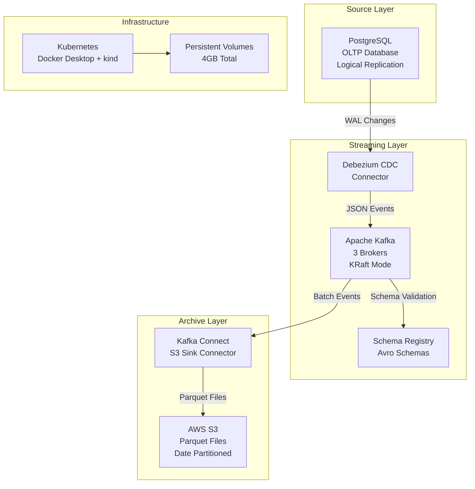

# Data Ingestion Pipeline - Design Document

## Overview

This document describes the design for a data ingestion pipeline that captures changes from PostgreSQL databases using Debezium CDC, streams them through Apache Kafka, and archives them to AWS S3. The system is designed to handle 10,000 events per second while maintaining data integrity and reliability.

The architecture follows event-driven patterns with three main components:
- **Source Layer**: PostgreSQL with logical replication for CDC
- **Streaming Layer**: Apache Kafka for event streaming and buffering
- **Archive Layer**: AWS S3 for durable data storage with Parquet format

## Architecture

### High-Level Architecture Diagram



### Data Flow Architecture

#### Change Data Capture Flow
1. **PostgreSQL Configuration**: Logical replication enabled with appropriate WAL settings
2. **Debezium Capture**: Row-level changes captured and converted to JSON events
3. **Kafka Publishing**: Events published to topic partitions based on table and primary key
4. **Schema Evolution**: Avro schemas registered and validated through Schema Registry
5. **Reliable Delivery**: At-least-once delivery with idempotent producers

#### Archival Flow
1. **Kafka Consumption**: S3 Sink connector consumes from all CDC topics
2. **Format Conversion**: JSON events converted to Parquet format for efficient storage
3. **Partitioning Strategy**: Files partitioned by date (YYYY/MM/DD/HH) for optimal access
4. **Batch Processing**: Events batched for efficient S3 uploads (1000 records or 60 seconds)
5. **Error Handling**: Failed records routed to dead letter queues for manual review

## Components and Interfaces

### PostgreSQL (Source Database)

**Purpose**: Primary transactional database and CDC source
**Configuration**:
```yaml
postgresql:
  resources:
    requests: { memory: "512Mi", cpu: "500m" }
    limits: { memory: "512Mi", cpu: "1000m" }
  config:
    wal_level: logical
    max_replication_slots: 4
    max_wal_senders: 4
  storage: 5Gi
```

**Schema Design**:
```sql
-- E-commerce dimension tables
CREATE TABLE users (
    id SERIAL PRIMARY KEY,
    email VARCHAR(255) UNIQUE NOT NULL,
    first_name VARCHAR(100) NOT NULL,
    last_name VARCHAR(100) NOT NULL,
    created_at TIMESTAMP DEFAULT NOW(),
    updated_at TIMESTAMP DEFAULT NOW()
);

CREATE TABLE products (
    id SERIAL PRIMARY KEY,
    name VARCHAR(255) NOT NULL,
    description TEXT,
    price DECIMAL(10,2) NOT NULL CHECK (price >= 0),
    stock_quantity INTEGER DEFAULT 0 CHECK (stock_quantity >= 0),
    category VARCHAR(100),
    created_at TIMESTAMP DEFAULT NOW(),
    updated_at TIMESTAMP DEFAULT NOW()
);

CREATE TABLE orders (
    id SERIAL PRIMARY KEY,
    user_id INTEGER NOT NULL REFERENCES users(id) ON DELETE CASCADE,
    status VARCHAR(50) DEFAULT 'pending' CHECK (status IN ('pending', 'processing', 'shipped', 'delivered', 'cancelled')),
    total_amount DECIMAL(10,2) NOT NULL CHECK (total_amount >= 0),
    shipping_address TEXT,
    created_at TIMESTAMP DEFAULT NOW(),
    updated_at TIMESTAMP DEFAULT NOW()
);

CREATE TABLE order_items (
    id SERIAL PRIMARY KEY,
    order_id INTEGER NOT NULL REFERENCES orders(id) ON DELETE CASCADE,
    product_id INTEGER NOT NULL REFERENCES products(id) ON DELETE CASCADE,
    quantity INTEGER NOT NULL CHECK (quantity > 0),
    unit_price DECIMAL(10,2) NOT NULL CHECK (unit_price >= 0),
    created_at TIMESTAMP DEFAULT NOW()
);

-- Trigger for updated_at timestamps
CREATE OR REPLACE FUNCTION update_updated_at_column()
RETURNS TRIGGER AS $$
BEGIN
    NEW.updated_at = CURRENT_TIMESTAMP;
    RETURN NEW;
END;
$$ language 'plpgsql';

CREATE TRIGGER update_users_updated_at BEFORE UPDATE ON users
    FOR EACH ROW EXECUTE FUNCTION update_updated_at_column();
```

### Kafka Connect Cluster

**Purpose**: Distributed connector runtime with automatic plugin installation
**Configuration**:
```yaml
kafka-connect:
  replicas: 1  # Single worker optimized for 4Gi constraint
  resources:
    requests: { memory: "1Gi", cpu: "500m" }
    limits: { memory: "1Gi", cpu: "1" }
  
  plugin_installation:
    init_container: "curlimages/curl"
    plugins:
      debezium_postgresql:
        source: "https://api.hub.confluent.io/api/plugins/debezium/debezium-connector-postgresql/versions/2.4.2/archive"
        install_path: "/kafka/connect/debezium-postgres"
      s3_sink:
        source: "https://api.hub.confluent.io/api/plugins/confluentinc/kafka-connect-s3/versions/10.5.0/archive"
        install_path: "/kafka/connect/s3-sink"
  
  jvm_optimization:
    heap_percentage: 75.0  # -XX:MaxRAMPercentage=75.0
    gc_algorithm: "G1GC"
    gc_pause_target: "200ms"
    direct_memory: "128m"
    
  distributed_config:
    group_id: "connect-cluster"
    config_storage_topic: "connect-configs"
    offset_storage_topic: "connect-offsets"
    status_storage_topic: "connect-status"
    config_storage_replication_factor: 3
    offset_storage_replication_factor: 3
    status_storage_replication_factor: 3
```

### Apache Kafka (Event Streaming Platform)

**Purpose**: Central event streaming backbone with high availability
**Configuration**:
```yaml
kafka:
  replicas: 3
  resources:
    requests: { memory: "512Mi", cpu: "250m" }
    limits: { memory: "682Mi", cpu: "500m" }
  storage: 10Gi
  config:
    # KRaft mode configuration
    process.roles: broker,controller
    controller.quorum.voters: 1@kafka-0:9093,2@kafka-1:9093,3@kafka-2:9093
    # Performance tuning for 10k events/sec
    num.network.threads: 8
    num.io.threads: 16
    socket.send.buffer.bytes: 102400
    socket.receive.buffer.bytes: 102400
    socket.request.max.bytes: 104857600
    # Replication and durability
    default.replication.factor: 3
    min.insync.replicas: 2
    unclean.leader.election.enable: false
```

**Topic Configuration**:
```yaml
topics:
  - name: "postgres.public.users"
    partitions: 6
    replication: 3
    config:
      retention.ms: 604800000  # 7 days
      compression.type: lz4
      cleanup.policy: delete
  - name: "postgres.public.products"
    partitions: 6
    replication: 3
    config:
      retention.ms: 604800000  # 7 days
      compression.type: lz4
      cleanup.policy: delete
```

### Debezium CDC Connector

**Purpose**: Capture row-level changes from PostgreSQL with comprehensive error handling
**Configuration**:
```json
{
  "name": "postgres-cdc-connector",
  "config": {
    "connector.class": "io.debezium.connector.postgresql.PostgresConnector",
    "tasks.max": "1",
    "database.hostname": "postgresql.data-ingestion.svc.cluster.local",
    "database.port": "5432",
    "database.user": "${env:DBZ_DB_USERNAME}",
    "database.password": "${env:DBZ_DB_PASSWORD}",
    "database.dbname": "ecommerce",
    "database.server.name": "postgres",
    "topic.prefix": "postgres",
    "table.include.list": "public.users,public.products,public.orders,public.order_items",
    "plugin.name": "pgoutput",
    "slot.name": "debezium_slot",
    "publication.name": "dbz_publication",
    "key.converter": "io.confluent.connect.avro.AvroConverter",
    "value.converter": "io.confluent.connect.avro.AvroConverter",
    "key.converter.schema.registry.url": "http://schema-registry.data-ingestion.svc.cluster.local:8081",
    "value.converter.schema.registry.url": "http://schema-registry.data-ingestion.svc.cluster.local:8081",
    "key.converter.basic.auth.credentials.source": "USER_INFO",
    "value.converter.basic.auth.credentials.source": "USER_INFO",
    "key.converter.basic.auth.user.info": "${env:SCHEMA_AUTH_USER}:${env:SCHEMA_AUTH_PASS}",
    "value.converter.basic.auth.user.info": "${env:SCHEMA_AUTH_USER}:${env:SCHEMA_AUTH_PASS}",
    "transforms": "unwrap",
    "transforms.unwrap.type": "io.debezium.transforms.ExtractNewRecordState",
    "transforms.unwrap.drop.tombstones": "true",
    "transforms.unwrap.delete.handling.mode": "rewrite",
    "transforms.unwrap.add.fields": "op,ts_ms,source.ts_ms,source.lsn",
    "snapshot.mode": "initial",
    "heartbeat.interval.ms": "30000",
    "heartbeat.topics.prefix": "__debezium-heartbeat",
    "provide.transaction.metadata": "true",
    "decimal.handling.mode": "string",
    "time.precision.mode": "adaptive_time_microseconds",
    "errors.tolerance": "all",
    "errors.log.enable": "true",
    "errors.log.include.messages": "true",
    "errors.deadletterqueue.topic.name": "connect-dlq",
    "errors.deadletterqueue.topic.replication.factor": "3",
    "errors.deadletterqueue.context.headers.enable": "true",
    "errors.retry.delay.max.ms": "60000",
    "errors.retry.timeout": "300000"
  }
}
```

### Schema Registry

**Purpose**: Manage Avro schemas and ensure compatibility with comprehensive authentication
**Configuration**:
```yaml
schema-registry:
  resources:
    requests: { memory: "384Mi", cpu: "250m" }
    limits: { memory: "512Mi", cpu: "500m" }
  config:
    kafkastore.bootstrap.servers: "kafka-headless.data-ingestion.svc.cluster.local:9092"
    kafkastore.topic: "_schemas"
    kafkastore.topic.replication.factor: 3
    schema.compatibility.level: "BACKWARD"
    debug: false
```

**Authentication Configuration**:
```yaml
authentication:
  method: "BASIC"
  realm: "SchemaRegistry"
  jaas_config: |
    SchemaRegistry {
      org.eclipse.jetty.jaas.spi.PropertyFileLoginModule required
      file="/etc/schema-registry/user.properties";
    };
  
  user_roles:
    admin:
      permissions: ["admin"]
      description: "Full administrative access to all schema operations"
    probe:
      permissions: ["readonly"]
      description: "Health check and monitoring access only"
    developer:
      permissions: ["developer"]
      description: "Schema read/write access for development"

  authorization:
    super_users: "User:admin"
    roles: ["admin", "developer", "readonly"]
```

### Kafka Connect S3 Sink

**Purpose**: Archive Kafka events to AWS S3 in Parquet format with comprehensive error handling
**Configuration**:
```json
{
  "name": "s3-sink-connector",
  "config": {
    "connector.class": "io.confluent.connect.s3.S3SinkConnector",
    "tasks.max": "24",
    "topics.regex": "postgres\\.public\\..*",
    "s3.bucket.name": "${env:S3_BUCKET_NAME}",
    "s3.region": "us-east-1",
    "s3.part.size": "5242880",
    "format.class": "io.confluent.connect.s3.format.parquet.ParquetFormat",
    "parquet.codec": "snappy",
    "parquet.block.size": "16777216",
    "parquet.page.size": "1048576",
    "partitioner.class": "io.confluent.connect.storage.partitioner.TimeBasedPartitioner",
    "partition.duration.ms": "3600000",
    "path.format": "'year'=YYYY/'month'=MM/'day'=dd/'hour'=HH",
    "locale": "en-US",
    "timezone": "UTC",
    "timestamp.extractor": "Record",
    "flush.size": "1000",
    "rotate.interval.ms": "60000",
    "key.converter": "io.confluent.connect.avro.AvroConverter",
    "value.converter": "io.confluent.connect.avro.AvroConverter",
    "key.converter.schema.registry.url": "http://schema-registry.data-ingestion.svc.cluster.local:8081",
    "value.converter.schema.registry.url": "http://schema-registry.data-ingestion.svc.cluster.local:8081",
    "key.converter.basic.auth.credentials.source": "USER_INFO",
    "value.converter.basic.auth.credentials.source": "USER_INFO",
    "key.converter.basic.auth.user.info": "${env:SCHEMA_AUTH_USER}:${env:SCHEMA_AUTH_PASS}",
    "value.converter.basic.auth.user.info": "${env:SCHEMA_AUTH_USER}:${env:SCHEMA_AUTH_PASS}",
    "consumer.override.max.poll.records": "1000",
    "consumer.override.max.poll.interval.ms": "180000",
    "consumer.override.fetch.max.bytes": "5242880",
    "errors.tolerance": "all",
    "errors.log.enable": "true",
    "errors.log.include.messages": "true",
    "errors.deadletterqueue.topic.name": "s3-sink-dlq",
    "errors.deadletterqueue.topic.replication.factor": "3",
    "errors.deadletterqueue.context.headers.enable": "true",
    "errors.retry.timeout": "0",
    "behavior.on.null.values": "ignore",
    "s3.retry.backoff.ms": "2000",
    "s3.retry.jitter.ms": "1000",
    "s3.max.retries": "7",
    "storage.class": "io.confluent.connect.s3.storage.S3Storage"
  }
}
```

## Data Models

### CDC Event Schema

**Debezium Change Event Structure**:
```json
{
  "schema": {
    "type": "struct",
    "fields": [
      {"field": "before", "type": "struct", "optional": true},
      {"field": "after", "type": "struct", "optional": true},
      {"field": "source", "type": "struct"},
      {"field": "op", "type": "string"},
      {"field": "ts_ms", "type": "int64", "optional": true}
    ]
  },
  "payload": {
    "before": null,
    "after": {
      "user_id": "550e8400-e29b-41d4-a716-446655440000",
      "email": "john.doe@example.com",
      "first_name": "John",
      "last_name": "Doe",
      "tier": "gold",
      "created_at": "2024-01-15T10:30:00Z",
      "updated_at": "2024-01-15T10:30:00Z"
    },
    "source": {
      "version": "2.4.2",
      "connector": "postgresql",
      "name": "postgres",
      "ts_ms": 1705315800000,
      "snapshot": "false",
      "db": "ecommerce",
      "sequence": "[\"24023119\",\"24023120\"]",
      "schema": "public",
      "table": "users",
      "txId": 564,
      "lsn": 24023120,
      "xmin": null
    },
    "op": "c",
    "ts_ms": 1705315800123
  }
}
```

### S3 Parquet Schema

**Optimized Parquet Schema for Analytics**:
```sql
-- Flattened structure for efficient querying
CREATE TABLE s3_cdc_events (
    -- Event metadata
    event_timestamp TIMESTAMP,
    operation_type STRING,  -- c, u, d, r
    table_name STRING,
    
    -- Source metadata
    connector_version STRING,
    database_name STRING,
    schema_name STRING,
    transaction_id BIGINT,
    lsn BIGINT,
    
    -- Record data (JSON for flexibility)
    before_data STRING,  -- JSON representation
    after_data STRING,   -- JSON representation
    
    -- Partitioning columns
    year INT,
    month INT,
    day INT,
    hour INT
)
PARTITIONED BY (year, month, day, hour)
STORED AS PARQUET
LOCATION 's3://datapipe-ingestion-123/cdc-events/'
```

## Error Handling

### Error Classification and Handling

**1. Transient Errors**
- Network timeouts between components
- Temporary resource constraints
- Kafka broker unavailability

**Handling Strategy**:
```yaml
retry_policy:
  max_retries: 3
  backoff_strategy: exponential
  initial_delay: 1s
  max_delay: 30s
  jitter: true
```

**2. Data Quality Errors**
- Schema validation failures
- Invalid data formats
- Constraint violations

**Handling Strategy**:
```yaml
dead_letter_queue:
  topic: "connect-dlq"
  partitions: 3
  retention: 7d
  alert_threshold: 100  # messages per hour
```

**3. System Errors**
- PostgreSQL connection failures
- S3 authentication issues
- Kafka Connect failures

**Handling Strategy**:
```yaml
circuit_breaker:
  failure_threshold: 5
  timeout: 30s
  half_open_max_calls: 3
```

### Dead Letter Queue Infrastructure

**Purpose**: Handle failed messages and provide error recovery mechanisms

**DLQ Topology**:
```yaml
dead_letter_queues:
  connect-dlq:
    purpose: "General Kafka Connect connector failures"
    partitions: 3
    replication_factor: 3
    retention: "604800000"  # 7 days
    compression: "lz4"
    cleanup_policy: "delete"
    
  s3-sink-dlq:
    purpose: "S3 Sink connector specific failures"
    partitions: 3
    replication_factor: 3
    retention: "604800000"  # 7 days
    compression: "lz4"
    cleanup_policy: "delete"
    
  schema-changes.postgres:
    purpose: "Schema history for Debezium connector"
    partitions: 1
    replication_factor: 3
    retention: "604800000"  # 7 days
    cleanup_policy: "compact"
```

**Error Routing Configuration**:
```yaml
error_handling:
  debezium_connector:
    errors.tolerance: "all"
    errors.log.enable: "true"
    errors.log.include.messages: "true"
    errors.deadletterqueue.topic.name: "connect-dlq"
    errors.deadletterqueue.context.headers.enable: "true"
    errors.retry.timeout: "300000"
    errors.retry.delay.max.ms: "60000"
    
  s3_sink_connector:
    errors.tolerance: "all"
    errors.log.enable: "true"
    errors.log.include.messages: "true"
    errors.deadletterqueue.topic.name: "s3-sink-dlq"
    errors.deadletterqueue.context.headers.enable: "true"
    errors.retry.timeout: "0"  # No retries for S3 failures
```

### Enhanced Monitoring and Heartbeat Configuration

**Heartbeat Monitoring**:
```yaml
heartbeat_config:
  debezium:
    heartbeat.interval.ms: "30000"
    heartbeat.topics.prefix: "__debezium-heartbeat"
    purpose: "Detect connector liveness and CDC lag"
    
  kafka_connect:
    status.update.interval.ms: "10000"
    retriable.restart.connector.wait.ms: "10000"
    purpose: "Worker health and task coordination"
```

**Environment Variable Configuration**:
```yaml
config_providers:
  env_provider:
    class: "org.apache.kafka.common.config.provider.EnvVarConfigProvider"
    usage: "Secure credential injection via environment variables"
    examples:
      - "${env:DBZ_DB_USERNAME}"
      - "${env:DBZ_DB_PASSWORD}"
      - "${env:S3_BUCKET_NAME}"
      - "${env:SCHEMA_AUTH_USER}"
      - "${env:SCHEMA_AUTH_PASS}"
```

### Observability Metrics

**Pipeline-Specific Metrics Exposed**:
```yaml
metrics:
  - name: "cdc_events_per_second"
    type: "gauge"
    labels: ["table", "operation"]
    description: "Rate of CDC events processed per second by table and operation type"
  - name: "kafka_consumer_lag"
    type: "gauge"
    labels: ["topic", "partition"]
    description: "Consumer lag for CDC topics"
  - name: "s3_upload_success_rate"
    type: "counter"
    labels: ["connector", "bucket"]
    description: "Success rate of S3 uploads"
  - name: "schema_registry_requests"
    type: "counter"
    labels: ["subject", "version"]
    description: "Schema Registry requests for CDC schemas"
  - name: "data_quality_score"
    type: "gauge"
    labels: ["checkpoint", "table"]
    description: "Data quality score for CDC events"
```

*Note: Monitoring infrastructure (Prometheus, Grafana, Alertmanager) and alert rules are provided by the orchestration-monitoring feature.*

## Data Security Configuration

### Authentication and Authorization
```yaml
security:
  postgresql:
    auth_method: "md5"
    ssl_mode: "require"
    users:
      - name: "debezium"
        permissions: ["REPLICATION", "SELECT"]
        tables: ["users", "products", "orders", "order_items"]
  
  kafka:
    security_protocol: "PLAINTEXT"  # Local development
    network_policies: "default_deny_all"
    inter_broker_communication: "secured"
  
  schema_registry:
    auth_method: "BASIC"
    jaas_config: "PropertyFileLoginModule"
    roles: ["admin", "developer", "readonly"]
  
  aws_s3:
    auth_method: "access_keys"  # Local development
    encryption: "SSE-S3"
    bucket_policy: "least_privilege"
  
  kubernetes:
    network_policies: "default_deny_all_with_specific_ingress_egress"
    service_accounts: "dedicated_per_component"
    pod_security: "baseline_enforcement"
    capabilities: "drop_all_add_minimal"
```

### Data Access Controls
```yaml
data_access:
  cdc_user_permissions:
    - database: "ecommerce"
      schema: "public"
      tables: ["users", "products", "orders", "order_items"]
      permissions: ["SELECT", "REPLICATION"]
  
  s3_bucket_policy:
    - effect: "Allow"
      actions: ["s3:PutObject", "s3:PutObjectAcl"]
      resources: ["arn:aws:s3:::datapipe-ingestion-*/topics/*"]
    - effect: "Allow"
      actions: ["s3:ListBucket"]
      resources: ["arn:aws:s3:::datapipe-ingestion-*"]
  
  kubernetes_rbac:
    - service_account: "kafka-connect-sa"
      permissions: ["get", "list", "watch"]
      resources: ["configmaps", "secrets", "pods"]
    - service_account: "postgresql-sa"
      permissions: ["minimal"]
      auto_mount_token: false
  
  network_segmentation:
    - default_policy: "deny_all"
    - postgresql_ingress: "kafka_connect_only"
    - kafka_ingress: "connect_and_schema_registry_only"
    - external_egress: "s3_https_only"
```

### Network Security Implementation

**Comprehensive Network Policies**:
```yaml
network_security:
  default_policy: "deny_all"
  
  postgresql_access:
    ingress:
      - from: "kafka-connect pods"
        ports: [5432]
      - from: "kind node network (172.18.0.0/16)"
        ports: [5432]  # NodePort access for development
    
  kafka_access:
    ingress:
      - from: "kafka-connect, schema-registry pods"
        ports: [9092, 9093]
      - from: "kafka cluster internal"
        ports: [9092, 9093]
      - from: "kind node network (172.18.0.0/16)"
        ports: [9092]  # NodePort access for development
    egress:
      - to: "kafka cluster internal"
        ports: [9092, 9093]
        
  kafka_connect_access:
    ingress:
      - from: "kafka-connect cluster internal"
        ports: [8083]
    egress:
      - to: "postgresql pods"
        ports: [5432]
      - to: "kafka pods"
        ports: [9092]
      - to: "schema-registry pods"
        ports: [8081]
      - to: "AWS S3 (0.0.0.0/0 except private ranges)"
        ports: [443]  # HTTPS only
        
  schema_registry_access:
    ingress:
      - from: "kafka-connect pods"
        ports: [8081]
    egress:
      - to: "kafka pods"
        ports: [9092]

  dns_resolution:
    all_pods:
      egress:
        - to: "kube-system/kube-dns"
          ports: [53]  # UDP and TCP
```

**Pod Security Contexts**:
```yaml
security_contexts:
  postgresql:
    runAsNonRoot: true
    runAsUser: 70
    runAsGroup: 70
    fsGroup: 70
    seccompProfile: RuntimeDefault
    capabilities: drop ["ALL"]
    
  kafka:
    runAsNonRoot: true
    runAsUser: 1000
    runAsGroup: 1000
    fsGroup: 1000
    seccompProfile: RuntimeDefault
    capabilities: drop ["ALL"]
    
  schema_registry:
    runAsNonRoot: true
    runAsUser: 1000
    runAsGroup: 1000
    fsGroup: 1000
    seccompProfile: RuntimeDefault
    capabilities: drop ["ALL"]
    
  kafka_connect:
    runAsNonRoot: true
    runAsUser: 1000
    runAsGroup: 1000
    fsGroup: 1000
    seccompProfile: RuntimeDefault
    capabilities: drop ["ALL"]
```

*Note: Infrastructure-level security (sealed secrets, TLS encryption, system audit logging) is provided by the orchestration-monitoring feature.*

## Performance and Scalability

### Resource Allocation (4Gi Total)
```yaml
resource_allocation:
  postgresql: 512Mi RAM, 1 CPU
  kafka_brokers: 2Gi RAM (shared HA cluster allocation), 1.5 CPU
    # Individual broker allocation: 512Mi request, 682Mi limit each
  schema_registry: 512Mi RAM (384Mi request), 0.5 CPU
  kafka_connect: 1Gi RAM, 1 CPU
  total: 4Gi RAM, 4 CPU
```

### Performance Optimization

**PostgreSQL Tuning**:
```sql
-- Optimize for CDC workload
ALTER SYSTEM SET shared_buffers = '256MB';
ALTER SYSTEM SET effective_cache_size = '1GB';
ALTER SYSTEM SET wal_buffers = '16MB';
ALTER SYSTEM SET checkpoint_completion_target = 0.9;
ALTER SYSTEM SET max_wal_size = '2GB';
```

**Kafka Tuning**:
```properties
# Producer optimization
batch.size=32768
linger.ms=10
compression.type=lz4
acks=1

# Broker optimization
num.replica.fetchers=4
replica.fetch.max.bytes=1048576

# GC optimization for 2GB heap
-XX:+UseG1GC
-XX:MaxGCPauseMillis=20
-XX:InitiatingHeapOccupancyPercent=35
-XX:+ExplicitGCInvokesConcurrent
```

### Scalability Considerations

**Horizontal Scaling**:
- Add Kafka partitions for increased parallelism
- Scale Kafka Connect tasks based on throughput
- Implement table-level CDC connectors for isolation

**Vertical Scaling**:
- Increase PostgreSQL memory for larger WAL buffers
- Add CPU cores for Kafka brokers under high load
- Optimize JVM heap sizes for Kafka Connect

## Container Orchestration Requirements

### Memory Limits and Reservations
```yaml
container_limits:
  postgresql:
    memory: "512Mi"
    memory_request: "512Mi"
    memory_limit_enforcement: true
  kafka:
    memory: "2Gi"  # Shared HA cluster allocation
    memory_request: "512Mi"
    gc_monitoring: true
    gc_pause_threshold: "50ms"
  schema_registry:
    memory: "512Mi"
    memory_request: "384Mi"
    jvm_optimization: true
  kafka_connect:
    memory: "1Gi"
    memory_request: "1Gi"
```

### System Memory Considerations
- Total application allocation: 4GB
- System memory reservation: 2GB (handled at cluster level)
- OOM killer protection: Enabled via cgroups

## Deployment Architecture

### Kubernetes Deployment

**Kind Cluster Configuration**:
```yaml
kind: Cluster
apiVersion: kind.x-k8s.io/v1alpha4
nodes:
- role: control-plane
- role: worker
- role: worker
```

**Persistent Volume Strategy**:
```yaml
apiVersion: v1
kind: PersistentVolume
metadata:
  name: postgresql-pv
spec:
  capacity:
    storage: 5Gi
  accessModes:
  - ReadWriteOnce
  persistentVolumeReclaimPolicy: Retain
  storageClassName: local-path
```

**Helm Chart Structure**:
```
data-ingestion-pipeline/
├── Chart.yaml
├── values.yaml
├── values-dev.yaml
└── templates/
    ├── postgresql/
    ├── kafka/
    ├── schema-registry/
    └── kafka-connect/
```

This design provides a robust, scalable data ingestion pipeline that can handle 10,000 events per second while maintaining data integrity and comprehensive error handling capabilities. The pipeline exposes comprehensive metrics for monitoring and integrates with infrastructure-level security controls provided by the orchestration-monitoring feature.