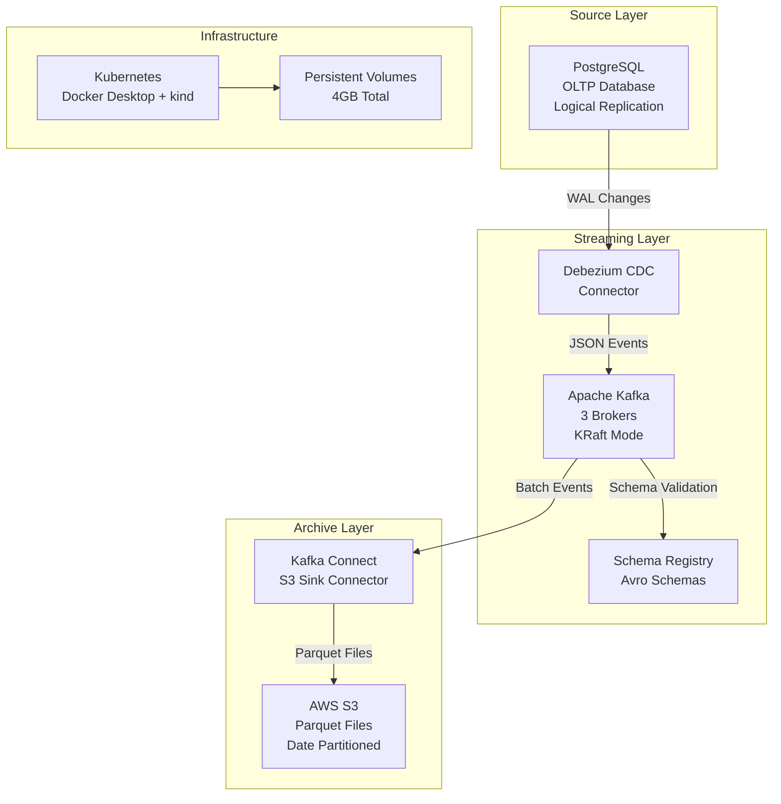

# Data Ingestion Pipeline - Design Document

## Overview

This document describes the design for a data ingestion pipeline that captures changes from PostgreSQL databases using Debezium CDC, streams them through Apache Kafka, and archives them to AWS S3. The system is designed to handle 10,000 events per second while maintaining data integrity and reliability.

The architecture follows event-driven patterns with three main components:
- **Source Layer**: PostgreSQL with logical replication for CDC
- **Streaming Layer**: Apache Kafka for event streaming and buffering
- **Archive Layer**: AWS S3 for durable data storage with Parquet format

## Architecture

### High-Level Architecture Diagram



### Data Flow Architecture

#### Change Data Capture Flow
1. **PostgreSQL Configuration**: Logical replication enabled with appropriate WAL settings
2. **Debezium Capture**: Row-level changes captured and converted to JSON events
3. **Kafka Publishing**: Events published to topic partitions based on table and primary key
4. **Schema Evolution**: Avro schemas registered and validated through Schema Registry
5. **Reliable Delivery**: At-least-once delivery with idempotent producers

#### Archival Flow
1. **Kafka Consumption**: S3 Sink connector consumes from all CDC topics
2. **Format Conversion**: JSON events converted to Parquet format for efficient storage
3. **Partitioning Strategy**: Files partitioned by date (YYYY/MM/DD/HH) for optimal access
4. **Batch Processing**: Events batched for efficient S3 uploads (1000 records or 60 seconds)
5. **Error Handling**: Failed records routed to dead letter queues for manual review

## Components and Interfaces

### PostgreSQL (Source Database)

**Purpose**: Primary transactional database and CDC source
**Configuration**:
```yaml
postgresql:
  resources:
    requests: { memory: "512Mi", cpu: "500m" }
    limits: { memory: "768Mi", cpu: "1000m" }
  config:
    wal_level: logical
    max_replication_slots: 4
    max_wal_senders: 4
    shared_preload_libraries: 'pg_stat_statements'
  storage: 5Gi
```

**Schema Design**:
```sql
-- E-commerce dimension tables
CREATE TABLE users (
    user_id UUID PRIMARY KEY,
    email VARCHAR(255) UNIQUE NOT NULL,
    first_name VARCHAR(100),
    last_name VARCHAR(100),
    tier VARCHAR(20) DEFAULT 'bronze',
    created_at TIMESTAMP DEFAULT CURRENT_TIMESTAMP,
    updated_at TIMESTAMP DEFAULT CURRENT_TIMESTAMP
);

CREATE TABLE products (
    product_id UUID PRIMARY KEY,
    name VARCHAR(255) NOT NULL,
    category VARCHAR(100),
    price DECIMAL(10,2),
    is_active BOOLEAN DEFAULT true,
    created_at TIMESTAMP DEFAULT CURRENT_TIMESTAMP,
    updated_at TIMESTAMP DEFAULT CURRENT_TIMESTAMP
);

-- Trigger for updated_at timestamps
CREATE OR REPLACE FUNCTION update_updated_at_column()
RETURNS TRIGGER AS $$
BEGIN
    NEW.updated_at = CURRENT_TIMESTAMP;
    RETURN NEW;
END;
$$ language 'plpgsql';

CREATE TRIGGER update_users_updated_at BEFORE UPDATE ON users
    FOR EACH ROW EXECUTE FUNCTION update_updated_at_column();
```

### Apache Kafka (Event Streaming Platform)

**Purpose**: Central event streaming backbone with high availability
**Configuration**:
```yaml
kafka:
  replicas: 3
  resources:
    requests: { memory: "512Mi", cpu: "250m" }
    limits: { memory: "682Mi", cpu: "500m" }
  storage: 10Gi
  config:
    # KRaft mode configuration
    process.roles: broker,controller
    controller.quorum.voters: 1@kafka-0:9093,2@kafka-1:9093,3@kafka-2:9093
    # Performance tuning for 10k events/sec
    num.network.threads: 8
    num.io.threads: 16
    socket.send.buffer.bytes: 102400
    socket.receive.buffer.bytes: 102400
    socket.request.max.bytes: 104857600
    # Replication and durability
    default.replication.factor: 3
    min.insync.replicas: 2
    unclean.leader.election.enable: false
```

**Topic Configuration**:
```yaml
topics:
  - name: "cdc.postgres.users"
    partitions: 6
    replication: 3
    config:
      retention.ms: 604800000  # 7 days
      compression.type: lz4
      cleanup.policy: delete
  - name: "cdc.postgres.products"
    partitions: 6
    replication: 3
    config:
      retention.ms: 604800000  # 7 days
      compression.type: lz4
      cleanup.policy: delete
```

### Debezium CDC Connector

**Purpose**: Capture row-level changes from PostgreSQL
**Configuration**:
```json
{
  "name": "postgres-cdc-connector",
  "config": {
    "connector.class": "io.debezium.connector.postgresql.PostgresConnector",
    "database.hostname": "postgresql",
    "database.port": "5432",
    "database.user": "debezium",
    "database.password": "${file:/opt/kafka/secrets/postgres-password.txt:password}",
    "database.dbname": "ecommerce",
    "database.server.name": "postgres",
    "table.include.list": "public.users,public.products",
    "plugin.name": "pgoutput",
    "slot.name": "debezium_slot",
    "publication.name": "debezium_publication",
    "key.converter": "io.confluent.connect.avro.AvroConverter",
    "value.converter": "io.confluent.connect.avro.AvroConverter",
    "key.converter.schema.registry.url": "http://schema-registry:8081",
    "value.converter.schema.registry.url": "http://schema-registry:8081",
    "transforms": "unwrap",
    "transforms.unwrap.type": "io.debezium.transforms.ExtractNewRecordState",
    "transforms.unwrap.drop.tombstones": "false"
  }
}
```

### Schema Registry

**Purpose**: Manage Avro schemas and ensure compatibility
**Configuration**:
```yaml
schema-registry:
  resources:
    requests: { memory: "384Mi", cpu: "250m" }
    limits: { memory: "512Mi", cpu: "500m" }
  config:
    kafkastore.bootstrap.servers: "kafka-0:9092,kafka-1:9092,kafka-2:9092"
    kafkastore.topic: "_schemas"
    kafkastore.topic.replication.factor: 3
    debug: false
```

### Kafka Connect S3 Sink

**Purpose**: Archive Kafka events to AWS S3 in Parquet format
**Configuration**:
```json
{
  "name": "s3-sink-connector",
  "config": {
    "connector.class": "io.confluent.connect.s3.S3SinkConnector",
    "tasks.max": "3",
    "topics.regex": "cdc\\.postgres\\..*",
    "s3.region": "us-east-1",
    "s3.bucket.name": "datapipe-ingestion-123",
    "s3.part.size": "5242880",
    "flush.size": "1000",
    "rotate.interval.ms": "60000",
    "timezone": "UTC",
    "partition.duration.ms": "3600000",
    "path.format": "'year'=YYYY/'month'=MM/'day'=dd/'hour'=HH",
    "locale": "en-US",
    "partitioner.class": "io.confluent.connect.storage.partitioner.TimeBasedPartitioner",
    "timestamp.extractor": "Record",
    "format.class": "io.confluent.connect.s3.format.parquet.ParquetFormat",
    "parquet.codec": "snappy",
    "key.converter": "io.confluent.connect.avro.AvroConverter",
    "value.converter": "io.confluent.connect.avro.AvroConverter",
    "key.converter.schema.registry.url": "http://schema-registry:8081",
    "value.converter.schema.registry.url": "http://schema-registry:8081",
    "aws.access.key.id": "${file:/opt/kafka/secrets/aws-credentials.txt:access_key}",
    "aws.secret.access.key": "${file:/opt/kafka/secrets/aws-credentials.txt:secret_key}"
  }
}
```

## Data Models

### CDC Event Schema

**Debezium Change Event Structure**:
```json
{
  "schema": {
    "type": "struct",
    "fields": [
      {"field": "before", "type": "struct", "optional": true},
      {"field": "after", "type": "struct", "optional": true},
      {"field": "source", "type": "struct"},
      {"field": "op", "type": "string"},
      {"field": "ts_ms", "type": "int64", "optional": true}
    ]
  },
  "payload": {
    "before": null,
    "after": {
      "user_id": "550e8400-e29b-41d4-a716-446655440000",
      "email": "john.doe@example.com",
      "first_name": "John",
      "last_name": "Doe",
      "tier": "gold",
      "created_at": "2024-01-15T10:30:00Z",
      "updated_at": "2024-01-15T10:30:00Z"
    },
    "source": {
      "version": "2.4.2",
      "connector": "postgresql",
      "name": "postgres",
      "ts_ms": 1705315800000,
      "snapshot": "false",
      "db": "ecommerce",
      "sequence": "[\"24023119\",\"24023120\"]",
      "schema": "public",
      "table": "users",
      "txId": 564,
      "lsn": 24023120,
      "xmin": null
    },
    "op": "c",
    "ts_ms": 1705315800123
  }
}
```

### S3 Parquet Schema

**Optimized Parquet Schema for Analytics**:
```sql
-- Flattened structure for efficient querying
CREATE TABLE s3_cdc_events (
    -- Event metadata
    event_timestamp TIMESTAMP,
    operation_type STRING,  -- c, u, d, r
    table_name STRING,
    
    -- Source metadata
    connector_version STRING,
    database_name STRING,
    schema_name STRING,
    transaction_id BIGINT,
    lsn BIGINT,
    
    -- Record data (JSON for flexibility)
    before_data STRING,  -- JSON representation
    after_data STRING,   -- JSON representation
    
    -- Partitioning columns
    year INT,
    month INT,
    day INT,
    hour INT
)
PARTITIONED BY (year, month, day, hour)
STORED AS PARQUET
LOCATION 's3://datapipe-ingestion-123/cdc-events/'
```

## Error Handling

### Error Classification and Handling

**1. Transient Errors**
- Network timeouts between components
- Temporary resource constraints
- Kafka broker unavailability

**Handling Strategy**:
```yaml
retry_policy:
  max_retries: 3
  backoff_strategy: exponential
  initial_delay: 1s
  max_delay: 30s
  jitter: true
```

**2. Data Quality Errors**
- Schema validation failures
- Invalid data formats
- Constraint violations

**Handling Strategy**:
```yaml
dead_letter_queue:
  topic: "cdc.errors.dlq"
  partitions: 3
  retention: 7d
  alert_threshold: 100  # messages per hour
```

**3. System Errors**
- PostgreSQL connection failures
- S3 authentication issues
- Kafka Connect failures

**Handling Strategy**:
```yaml
circuit_breaker:
  failure_threshold: 5
  timeout: 30s
  half_open_max_calls: 3
```

### Monitoring and Alerting

**Key Metrics**:
```yaml
metrics:
  - name: "cdc_events_per_second"
    type: "gauge"
    labels: ["table", "operation"]
  - name: "kafka_consumer_lag"
    type: "gauge"
    labels: ["topic", "partition"]
  - name: "s3_upload_success_rate"
    type: "counter"
    labels: ["connector", "bucket"]
  - name: "schema_registry_requests"
    type: "counter"
    labels: ["subject", "version"]
```

**Alert Rules**:
```yaml
alerts:
  - name: "HighCDCLag"
    condition: "kafka_consumer_lag > 10000"
    severity: "warning"
    duration: "5m"
  - name: "S3UploadFailures"
    condition: "s3_upload_success_rate < 0.95"
    severity: "critical"
    duration: "2m"
  - name: "SchemaValidationErrors"
    condition: "rate(schema_validation_errors[5m]) > 10"
    severity: "warning"
```

## Security Architecture

### Authentication and Authorization
```yaml
security:
  postgresql:
    auth_method: "md5"
    ssl_mode: "require"
    users:
      - name: "debezium"
        permissions: ["REPLICATION", "SELECT"]
        tables: ["users", "products"]
  
  kafka:
    security_protocol: "SASL_SSL"
    sasl_mechanism: "PLAIN"
    ssl_truststore_location: "/opt/kafka/ssl/truststore.jks"
  
  aws_s3:
    auth_method: "iam_role"
    encryption: "SSE-S3"
    bucket_policy: "least_privilege"
```

### Network Security
```yaml
network_policies:
  - name: "postgresql-access"
    spec:
      podSelector:
        matchLabels:
          app: postgresql
      policyTypes: ["Ingress"]
      ingress:
        - from:
          - podSelector:
              matchLabels:
                app: debezium-connect
          ports:
          - protocol: TCP
            port: 5432
```

## Performance and Scalability

### Resource Allocation (4Gi Total)
```yaml
resource_allocation:
  postgresql: 0.75Gi RAM, 1 CPU
  kafka_brokers: 2Gi RAM (shared HA cluster allocation), 1.5 CPU
  schema_registry: 0.5Gi RAM, 0.5 CPU
  kafka_connect: 0.75Gi RAM, 1 CPU
  total: 4Gi RAM, 4 CPU
```

### Performance Optimization

**PostgreSQL Tuning**:
```sql
-- Optimize for CDC workload
ALTER SYSTEM SET shared_buffers = '256MB';
ALTER SYSTEM SET effective_cache_size = '1GB';
ALTER SYSTEM SET wal_buffers = '16MB';
ALTER SYSTEM SET checkpoint_completion_target = 0.9;
ALTER SYSTEM SET max_wal_size = '2GB';
```

**Kafka Tuning**:
```properties
# Producer optimization
batch.size=32768
linger.ms=10
compression.type=lz4
acks=1

# Broker optimization
num.replica.fetchers=4
replica.fetch.max.bytes=1048576

# GC optimization for 2GB heap
-XX:+UseG1GC
-XX:MaxGCPauseMillis=20
-XX:InitiatingHeapOccupancyPercent=35
-XX:+ExplicitGCInvokesConcurrent
```

### Scalability Considerations

**Horizontal Scaling**:
- Add Kafka partitions for increased parallelism
- Scale Kafka Connect tasks based on throughput
- Implement table-level CDC connectors for isolation

**Vertical Scaling**:
- Increase PostgreSQL memory for larger WAL buffers
- Add CPU cores for Kafka brokers under high load
- Optimize JVM heap sizes for Kafka Connect

## Container Orchestration Requirements

### Memory Limits and Reservations
```yaml
container_limits:
  postgresql:
    memory: "768Mi"
    memory_request: "512Mi"
    memory_limit_enforcement: true
  kafka:
    memory: "2Gi"  # Shared HA cluster allocation
    memory_request: "512Mi"
    gc_monitoring: true
    gc_pause_threshold: "50ms"
  schema_registry:
    memory: "512Mi"
    memory_request: "384Mi"
    jvm_optimization: true
  kafka_connect:
    memory: "768Mi"
    memory_request: "512Mi"
```

### System Memory Considerations
- Total application allocation: 4GB
- System memory reservation: 2GB (handled at cluster level)
- OOM killer protection: Enabled via cgroups

## Deployment Architecture

### Kubernetes Deployment

**Kind Cluster Configuration**:
```yaml
kind: Cluster
apiVersion: kind.x-k8s.io/v1alpha4
nodes:
- role: control-plane
- role: worker
- role: worker
```

**Persistent Volume Strategy**:
```yaml
apiVersion: v1
kind: PersistentVolume
metadata:
  name: postgresql-pv
spec:
  capacity:
    storage: 5Gi
  accessModes:
  - ReadWriteOnce
  persistentVolumeReclaimPolicy: Retain
  storageClassName: local-path
```

**Helm Chart Structure**:
```
data-ingestion-pipeline/
├── Chart.yaml
├── values.yaml
├── values-dev.yaml
└── templates/
    ├── postgresql/
    ├── kafka/
    ├── schema-registry/
    └── kafka-connect/
```

This design provides a robust, scalable data ingestion pipeline that can handle 10,000 events per second while maintaining data integrity and providing comprehensive monitoring and error handling capabilities.