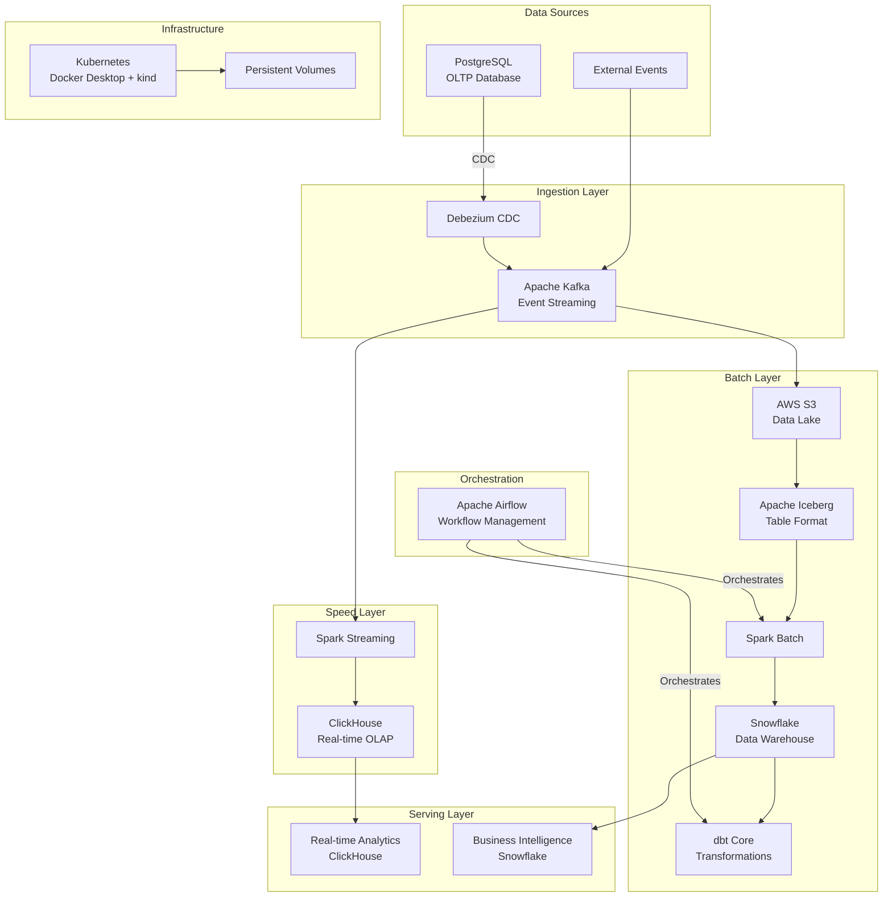

# Lambda Architecture Data Pipeline Design Document

## Overview

This document describes the design for a comprehensive Lambda Architecture data pipeline that integrates 11 modern data technologies to provide both real-time analytics and comprehensive batch processing capabilities. The system is designed to handle 20,000 events per second while maintaining eventual consistency between speed and batch layers.

The architecture follows Lambda Architecture principles with three distinct layers:
- **Speed Layer**: Real-time processing for low-latency analytics
- **Batch Layer**: Comprehensive processing for accuracy and completeness  
- **Serving Layer**: Unified access to both real-time and batch results

## Architecture

### High-Level Architecture Diagram



### Data Flow Architecture

#### Speed Layer Flow
1. **Change Data Capture**: Debezium captures row-level changes from PostgreSQL
2. **Event Streaming**: Changes are published to Kafka topics with proper partitioning
3. **Real-time Processing**: Spark Streaming consumes from Kafka with micro-batching (1-2 second windows)
4. **Real-time Storage**: Processed data is written to ClickHouse for sub-second analytics
5. **Real-time Serving**: Dashboards and monitoring tools query ClickHouse directly

#### Batch Layer Flow
1. **Data Archiving**: Kafka Connect S3 Sink reliably persists all events to AWS S3
2. **Data Lake Formation**: Apache Iceberg provides ACID transactions and schema evolution on S3
3. **Batch Processing**: Airflow orchestrates Spark jobs to process S3/Iceberg data
4. **Data Warehousing**: Processed data is loaded into Snowflake for comprehensive analysis
5. **Data Modeling**: dbt core performs transformations and creates business-ready data marts
6. **BI Serving**: Business intelligence tools connect to Snowflake for reporting and analysis

## Data Models and Schema Design

### E-commerce Event Schema Architecture

The data generator produces sophisticated e-commerce events with a rich schema designed for comprehensive analytics. The system generates realistic business data with proper relationships, user behavior patterns, and transaction flows.

#### Core Business Entities

**User Entity**
```json
{
  "user_id": "550e8400-e29b-41d4-a716-446655440000",
  "email": "john.smith@email.com",
  "first_name": "John",
  "last_name": "Smith",
  "date_of_birth": "1988-05-15T00:00:00Z",
  "registration_date": "2023-06-15T09:30:00Z",
  "country": "USA",
  "city": "New York",
  "tier": "gold",
  "is_active": true,
  "last_login": "2024-01-15T14:22:00Z"
}
```

**Product Entity**
```json
{
  "product_id": "550e8400-e29b-41d4-a716-446655440001",
  "name": "Apple MacBook Pro 16-inch",
  "category": "Electronics",
  "subcategory": "Laptops",
  "price": 2499.99,
  "cost": 1749.99,
  "brand": "Apple",
  "description": "High-performance laptop with M2 Pro chip",
  "is_active": true,
  "created_at": "2023-08-20T10:15:00Z"
}
```

**Transaction Entity**
```json
{
  "transaction_id": "550e8400-e29b-41d4-a716-446655440002",
  "user_id": "550e8400-e29b-41d4-a716-446655440000",
  "product_id": "550e8400-e29b-41d4-a716-446655440001",
  "quantity": 1,
  "unit_price": 2499.99,
  "total_amount": 2699.99,
  "discount_amount": 100.00,
  "tax_amount": 200.00,
  "status": "completed",
  "payment_method": "credit_card",
  "shipping_address": "123 Main St, New York, NY 10001",
  "created_at": "2024-01-15T15:30:00Z",
  "updated_at": "2024-01-15T15:35:00Z"
}
```

#### Event Schema Design

**Base UserEvent Structure**
All events share these common fields:
```json
{
  "event_id": "550e8400-e29b-41d4-a716-446655440003",
  "user_id": "550e8400-e29b-41d4-a716-446655440000",
  "session_id": "550e8400-e29b-41d4-a716-446655440004",
  "event_type": "page_view",
  "timestamp": "2024-01-15T15:30:00.123Z",
  "device_type": "desktop",
  "browser": "chrome",
  "ip_address": "192.168.1.100",
  "properties": {}
}
```

**Event Type Definitions**

1. **PAGE_VIEW** (35% of events)
```json
{
  "event_type": "page_view",
  "page_url": "/products/electronics",
  "properties": {
    "referrer": "https://google.com",
    "duration_seconds": 45
  }
}
```

2. **PRODUCT_VIEW** (25% of events)
```json
{
  "event_type": "product_view",
  "product_id": "550e8400-e29b-41d4-a716-446655440001",
  "page_url": "/product/macbook-pro",
  "properties": {
    "view_duration_seconds": 120,
    "came_from_search": true
  }
}
```

3. **SEARCH** (15% of events)
```json
{
  "event_type": "search",
  "search_query": "laptop",
  "properties": {
    "results_count": 45,
    "filters_applied": ["price", "brand"]
  }
}
```

4. **ADD_TO_CART** (10% of events)
```json
{
  "event_type": "add_to_cart",
  "product_id": "550e8400-e29b-41d4-a716-446655440001",
  "properties": {
    "quantity": 1,
    "cart_total": 2499.99
  }
}
```

5. **PURCHASE** (5% of events)
```json
{
  "event_type": "purchase",
  "properties": {
    "amount": 2699.99,
    "order_id": "550e8400-e29b-41d4-a716-446655440005"
  }
}
```

6. **REMOVE_FROM_CART** (4% of events)
7. **CHECKOUT_START** (3% of events)
8. **LOGIN** (2% of events)
9. **LOGOUT** (1% of events)

#### Business Logic and User Behavior

**User Tier System**
- **Bronze** (60%): Basic users with standard behavior
- **Silver** (25%): Engaged users with 1.3x activity multiplier
- **Gold** (12%): Premium users with 1.6x activity and higher discount probability
- **Platinum** (3%): VIP users with 1.9x activity and premium treatment

**Realistic Behavior Patterns**
- Weekend effect: 1.3x transaction multiplier on weekends
- Tier-based purchasing: Higher tiers buy more expensive items and larger quantities
- Session management: UUID-based session tracking with realistic duration patterns
- Product popularity: Weighted selection simulating real-world product popularity

#### Kafka Topic Structure

**Primary Topics**
- `user_events`: All user behavior events (9 event types)
- `transactions`: Purchase transactions with full business context

**Partitioning Strategy**
- Key: `user_id` for consistent user-centric analytics
- Partitions: 10-20 partitions per topic for 20k events/sec throughput
- Retention: 7 days for replay capability

## Components and Interfaces

### Core Data Services

#### PostgreSQL (OLTP Database)
- **Purpose**: Primary transactional database and CDC source
- **Configuration**: 
  - Logical replication enabled for CDC
  - Persistent volume for data storage
  - Resource allocation: 1GB RAM, 10GB storage
- **Interfaces**: 
  - Debezium connector for CDC
  - Application connections for transactional workloads

#### Apache Kafka (Event Streaming Platform)
- **Purpose**: Central event streaming backbone
- **Configuration**:
  - 3 brokers for high availability and fault tolerance
  - Topic partitioning strategy for 20k events/sec
  - Retention policy: 7 days for replay capability
  - Resource allocation: 3-4GB RAM total (1-1.5GB per broker), 30GB storage
- **Topics**:
  - `cdc.postgres.{table_name}`: CDC events from PostgreSQL
  - `events.raw`: External application events
  - `events.processed`: Processed events from speed layer
- **Interfaces**:
  - Debezium source connector
  - Kafka Connect S3 sink connector
  - Spark Streaming consumer
  - Schema Registry integration

#### ClickHouse (Real-time OLAP)
- **Purpose**: Speed layer analytics database
- **Configuration**:
  - Single node with ReplicatedMergeTree tables
  - Optimized for write throughput and query performance
  - Resource allocation: 2-3GB RAM, 15GB storage
- **Table Design**:
  ```sql
  -- Main events table for all event types
  CREATE TABLE user_events_realtime (
      event_id UUID,
      user_id UUID,
      session_id UUID,
      event_type LowCardinality(String),
      timestamp DateTime64(3),
      device_type LowCardinality(String),
      browser LowCardinality(String),
      ip_address IPv4,
      
      -- Event-specific fields (nullable for different event types)
      page_url Nullable(String),
      product_id Nullable(String),
      search_query Nullable(String),
      transaction_id Nullable(UUID), -- Link to transaction for PURCHASE events
      
      properties String, -- JSON string for flexible properties
      
      processing_time DateTime64(3) DEFAULT now64()
  ) ENGINE = ReplicatedMergeTree()
  ORDER BY (timestamp, event_type, user_id)
  PARTITION BY toYYYYMM(timestamp)
  SETTINGS index_granularity = 8192;
  
  -- Transactions table (one product per transaction)
  -- Note: Each transaction represents a single-product purchase
  CREATE TABLE transactions_realtime (
      transaction_id UUID,
      user_id UUID,
      product_id UUID,
      quantity UInt32,
      unit_price Decimal(10,2),
      total_amount Decimal(10,2),
      discount_amount Decimal(10,2),
      tax_amount Decimal(10,2),
      status LowCardinality(String),
      payment_method LowCardinality(String),
      created_at DateTime64(3),
      processing_time DateTime64(3) DEFAULT now64()
  ) ENGINE = ReplicatedMergeTree()
  ORDER BY (created_at, user_id, transaction_id)
  PARTITION BY toYYYYMM(created_at)
  SETTINGS index_granularity = 8192;
  
  -- Materialized views for real-time analytics
  CREATE MATERIALIZED VIEW user_activity_summary_mv
  ENGINE = SummingMergeTree()
  ORDER BY (toDate(timestamp), user_id, event_type)
  AS SELECT
      toDate(timestamp) as date,
      user_id,
      event_type,
      count() as event_count,
      uniq(session_id) as unique_sessions
  FROM user_events_realtime
  GROUP BY date, user_id, event_type;
  
  -- Real-time conversion funnel view
  CREATE MATERIALIZED VIEW conversion_funnel_mv
  ENGINE = SummingMergeTree()
  ORDER BY (toDate(timestamp), user_id)
  AS SELECT
      toDate(timestamp) as date,
      user_id,
      countIf(event_type = 'page_view') as page_views,
      countIf(event_type = 'product_view') as product_views,
      countIf(event_type = 'add_to_cart') as add_to_carts,
      countIf(event_type = 'checkout_start') as checkout_starts,
      countIf(event_type = 'purchase') as purchases
  FROM user_events_realtime
  GROUP BY date, user_id;
  ```
- **Interfaces**:
  - Spark Streaming writer
  - Analytics dashboard queries
  - Monitoring and alerting systems

### Cloud Services Integration

#### AWS S3 (Data Lake Storage)
- **Purpose**: Scalable, durable storage for data lake
- **Configuration**:
  - Bucket structure: `s3://data-lake/{year}/{month}/{day}/{hour}/`
  - Lifecycle policies for cost optimization
  - Server-side encryption enabled
- **Data Formats**: Parquet files with Iceberg metadata
- **Interfaces**:
  - Kafka Connect S3 Sink
  - Spark batch processing
  - Iceberg table operations

#### Apache Iceberg (Table Format)
- **Purpose**: ACID transactions and schema evolution for data lake
- **Features**:
  - Time travel capabilities
  - Hidden partitioning
  - Schema evolution without data rewrites
  - Snapshot isolation
- **Configuration**:
  - Catalog: Hadoop catalog with S3 backend
  - File format: Parquet with compression
  - Partitioning strategy: By date and event type

#### Snowflake (Data Warehouse)
- **Purpose**: Comprehensive data warehouse for batch layer
- **Configuration**:
  - Virtual warehouse: Small (auto-suspend after 5 minutes)
  - Database structure: Raw → Staging → Marts
  - Resource monitoring and cost controls
- **Schema Design**:
  ```sql
  -- RAW schema: Direct loads from Spark/S3
  CREATE SCHEMA raw;
  
  -- Raw events table (mirrors ClickHouse structure)
  -- Note: UUID fields from ClickHouse are converted to STRING during ETL
  CREATE TABLE raw.user_events (
      event_id STRING, -- Converted from ClickHouse UUID
      user_id STRING,  -- Converted from ClickHouse UUID
      session_id STRING, -- Converted from ClickHouse UUID
      event_type STRING,
      timestamp TIMESTAMP_NTZ,
      device_type STRING,
      browser STRING,
      ip_address STRING,
      
      -- Event-specific fields
      page_url STRING,
      product_id STRING,
      search_query STRING,
      transaction_id STRING, -- Converted from ClickHouse UUID
      
      properties VARIANT, -- JSON for flexible properties
      
      -- Metadata
      loaded_at TIMESTAMP_NTZ DEFAULT CURRENT_TIMESTAMP(),
      batch_id STRING,
      file_name STRING
  );
  
  -- Raw transactions table
  CREATE TABLE raw.transactions (
      transaction_id STRING,
      user_id STRING,
      product_id STRING,
      quantity NUMBER,
      unit_price NUMBER(10,2),
      total_amount NUMBER(10,2),
      discount_amount NUMBER(10,2),
      tax_amount NUMBER(10,2),
      status STRING,
      payment_method STRING,
      created_at TIMESTAMP_NTZ,
      
      -- Metadata
      loaded_at TIMESTAMP_NTZ DEFAULT CURRENT_TIMESTAMP(),
      batch_id STRING
  );
  
  -- STAGING schema: Cleaned and typed data
  CREATE SCHEMA staging;
  
  -- Staging events with data quality checks
  CREATE TABLE staging.events_cleaned (
      event_id STRING,
      user_id STRING,
      session_id STRING,
      event_type STRING,
      timestamp TIMESTAMP_NTZ,
      device_type STRING,
      browser STRING,
      ip_address STRING,
      
      -- Event-specific fields (properly typed)
      page_url STRING,
      product_id STRING,
      search_query STRING,
      transaction_id STRING,
      
      -- Parsed properties
      properties_parsed VARIANT,
      
      -- Data quality flags
      is_valid BOOLEAN,
      validation_errors VARIANT,
      
      processed_at TIMESTAMP_NTZ DEFAULT CURRENT_TIMESTAMP()
  );
  
  -- MARTS schema: Business-ready data models
  CREATE SCHEMA marts;
  
  -- User sessions with e-commerce metrics
  CREATE TABLE marts.user_sessions (
      session_id STRING,
      user_id STRING,
      session_start TIMESTAMP_NTZ,
      session_end TIMESTAMP_NTZ,
      session_duration_minutes NUMBER,
      
      -- Activity metrics
      page_views NUMBER,
      product_views NUMBER,
      searches NUMBER,
      add_to_cart_events NUMBER,
      purchases NUMBER,
      
      -- Business metrics
      total_spent NUMBER(10,2),
      items_purchased NUMBER,
      
      -- User context
      device_type STRING,
      browser STRING,
      
      -- Conversion flags
      converted_to_purchase BOOLEAN,
      
      created_at TIMESTAMP_NTZ DEFAULT CURRENT_TIMESTAMP()
  )
  CLUSTER BY (TO_DATE(session_start), user_id);
  
  -- Daily business metrics
  CREATE TABLE marts.daily_metrics (
      date DATE,
      
      -- Traffic metrics
      unique_users NUMBER,
      sessions NUMBER,
      page_views NUMBER,
      
      -- E-commerce metrics
      product_views NUMBER,
      searches NUMBER,
      add_to_cart_events NUMBER,
      purchases NUMBER,
      revenue NUMBER(10,2),
      
      -- Conversion rates
      session_to_purchase_rate NUMBER(5,4),
      view_to_cart_rate NUMBER(5,4),
      cart_to_purchase_rate NUMBER(5,4),
      
      created_at TIMESTAMP_NTZ DEFAULT CURRENT_TIMESTAMP()
  );
  ```
- **Interfaces**:
  - Spark Snowflake connector
  - dbt transformations
  - BI tool connections

### Processing Engines

#### Apache Spark (Distributed Processing)
- **Deployment**: Kubernetes-native with Spark Operator
- **Resource Allocation**: 4-6GB RAM total (driver + executors)
- **Configurations**:
  
  **Spark Streaming (Speed Layer)**:
  ```scala
  spark.streaming.batchDuration: 2s
  spark.streaming.backpressure.enabled: true
  spark.streaming.kafka.maxRatePerPartition: 1000
  spark.sql.streaming.checkpointLocation: s3://checkpoints/
  ```
  
  **Spark Batch (Batch Layer)**:
  ```scala
  spark.sql.adaptive.enabled: true
  spark.sql.adaptive.coalescePartitions.enabled: true
  spark.serializer: org.apache.spark.serializer.KryoSerializer
  ```

#### dbt Core (Data Transformation)
- **Purpose**: SQL-based transformations in Snowflake
- **Project Structure**:
  ```
  dbt_project/
  ├── models/
  │   ├── staging/     # Raw data cleaning
  │   ├── intermediate/ # Business logic
  │   └── marts/       # Final data products
  ├── tests/           # Data quality tests
  └── macros/          # Reusable SQL functions
  ```
- **Features**:
  - Incremental model updates
  - Data quality testing
  - Documentation generation
  - Lineage tracking

### Orchestration and Workflow Management

#### Apache Airflow (Workflow Orchestration)
- **Purpose**: Schedule and monitor batch processing workflows
- **Deployment**: Kubernetes with git-sync sidecar
- **DAG Structure**:
  ```python
  # Daily batch processing DAG
  dag = DAG(
      'daily_batch_processing',
      schedule_interval='@daily',
      catchup=False
  )
  
  # Tasks
  spark_batch_task = KubernetesPodOperator(...)
  dbt_run_task = KubernetesPodOperator(...)
  data_quality_check = PythonOperator(...)
  ```
- **Git-sync Configuration**:
  - Sidecar container pulls DAGs from Git repository
  - Automatic updates without service restart
  - Shared volume between git-sync and Airflow containers

## Data Models

### Event Schema Design

#### Raw Event Schema (Kafka/S3)
```json
{
  "event_id": "uuid",
  "timestamp": "2024-01-15T10:30:00Z",
  "event_type": "user_action",
  "source_system": "web_app",
  "user_id": 12345,
  "session_id": "session_uuid",
  "data": {
    "action": "page_view",
    "page": "/products/123",
    "referrer": "https://google.com"
  },
  "metadata": {
    "version": "1.0",
    "processing_timestamp": "2024-01-15T10:30:01Z"
  }
}
```

#### Speed Layer Schema (ClickHouse)
```sql
CREATE TABLE events_speed (
    event_id String,
    timestamp DateTime,
    event_type String,
    user_id UInt64,
    session_id String,
    action String,
    page String,
    referrer String,
    processing_time DateTime DEFAULT now(),
    data JSON  -- Flexible schema for rapid iteration
) ENGINE = ReplicatedMergeTree()
ORDER BY (timestamp, event_type, user_id)
PARTITION BY toYYYYMM(timestamp);
```

#### Batch Layer Schema (Snowflake)
```sql
-- Raw events table
CREATE TABLE raw.events (
    event_id STRING,
    timestamp TIMESTAMP_NTZ,
    event_type STRING,
    source_system STRING,
    user_id NUMBER,
    session_id STRING,
    data VARIANT,
    metadata VARIANT,
    loaded_at TIMESTAMP_NTZ DEFAULT CURRENT_TIMESTAMP()
);

-- Processed events table (after dbt)
CREATE TABLE marts.user_sessions (
    session_id STRING,
    user_id NUMBER,
    session_start TIMESTAMP_NTZ,
    session_end TIMESTAMP_NTZ,
    page_views NUMBER,
    unique_pages NUMBER,
    session_duration_minutes NUMBER,
    conversion_flag BOOLEAN
);
```

### Schema Evolution Strategy

#### Version Management
- **Schema Registry**: Confluent Schema Registry for Kafka topics
- **Iceberg Evolution**: Built-in schema evolution capabilities
- **dbt Versioning**: Model versioning with backward compatibility
- **ClickHouse Migration**: Automated ALTER TABLE scripts

#### Compatibility Rules
- **Forward Compatible**: New fields can be added
- **Backward Compatible**: Old consumers can read new data
- **Breaking Changes**: Require coordinated deployment across layers

## Error Handling

### Error Classification and Handling Strategy

#### Error Types and Responses
1. **Transient Errors** (Network timeouts, resource constraints)
   - Automatic retry with exponential backoff
   - Circuit breaker pattern for external services
   - Maximum retry attempts: 3

2. **Data Quality Errors** (Schema violations, null values)
   - Route to Dead Letter Queue (DLQ)
   - Alert data engineering team
   - Manual review and reprocessing

3. **System Errors** (Service unavailability, configuration issues)
   - Immediate alerting
   - Automatic failover where possible
   - Manual intervention required

#### Dead Letter Queue Implementation
```yaml
# Kafka DLQ topics
topics:
  - name: "events.raw.dlq"
    partitions: 3
    replication: 1
  - name: "events.processed.dlq"
    partitions: 3
    replication: 1
```

#### Error Monitoring and Alerting
- **Metrics**: Error rates, DLQ message counts, processing lag
- **Alerts**: PagerDuty integration for critical errors
- **Dashboards**: Real-time error monitoring in Grafana

### Data Consistency and Reconciliation

#### Lambda Architecture Consistency Model
- **Eventual Consistency**: Speed and batch layers converge over time
- **Reconciliation Window**: 24-hour SLA for consistency
- **Validation Jobs**: Automated comparison between layers

#### Reconciliation Process
```python
# Daily reconciliation job
def reconcile_layers(date):
    speed_data = query_clickhouse(date)
    batch_data = query_snowflake(date)
    
    differences = compare_datasets(speed_data, batch_data)
    
    if differences.count() > threshold:
        alert_data_team(differences)
        trigger_reprocessing(date)
```

## Testing Strategy

### Testing Pyramid

#### Unit Tests
- **Spark Transformations**: Test individual transformation logic
- **dbt Models**: Test SQL transformations and business logic
- **Utility Functions**: Test helper functions and data validation

#### Integration Tests
- **Component Tests**: Test individual service integrations
- **Pipeline Tests**: Test end-to-end data flow segments
- **Schema Tests**: Validate schema compatibility across services

#### End-to-End Tests
- **Full Pipeline Tests**: Complete data flow validation
- **Performance Tests**: Throughput and latency validation
- **Chaos Engineering**: Failure scenario testing

### Test Data Management
```yaml
# Test data generation
test_data:
  postgres_seed: 10000_records
  kafka_events: 1000_events_per_second
  duration: 300_seconds
  
validation:
  speed_layer_latency: < 5_seconds
  batch_layer_completeness: 100%
  data_consistency: 99.9%
```

## Security Architecture

### Authentication and Authorization
- **Kubernetes RBAC**: Role-based access control for all services
- **Service Accounts**: Dedicated accounts for each component
- **Secrets Management**: Sealed Secrets or HashiCorp Vault integration

### Network Security
```yaml
# Network policies
apiVersion: networking.k8s.io/v1
kind: NetworkPolicy
metadata:
  name: kafka-network-policy
spec:
  podSelector:
    matchLabels:
      app: kafka
  policyTypes:
  - Ingress
  - Egress
  ingress:
  - from:
    - podSelector:
        matchLabels:
          app: spark-streaming
    - podSelector:
        matchLabels:
          app: debezium
```

### Data Encryption
- **In Transit**: TLS 1.3 for all inter-service communication
- **At Rest**: 
  - S3 server-side encryption (SSE-S3)
  - Kubernetes encrypted persistent volumes
  - Snowflake automatic encryption

### Credential Management
```yaml
# Sealed Secret example
apiVersion: bitnami.com/v1alpha1
kind: SealedSecret
metadata:
  name: snowflake-credentials
spec:
  encryptedData:
    username: AgBy3i4OJSWK+PiTySYZZA9rO43cGDEQAx...
    password: AgBy3i4OJSWK+PiTySYZZA9rO43cGDEQAx...
    account: AgBy3i4OJSWK+PiTySYZZA9rO43cGDEQAx...
```

## Performance and Scalability

### Resource Requirements

#### Local Development Environment
- **Minimum**: 12GB RAM, 4 CPU cores, 100GB storage
- **Recommended**: 16GB RAM, 8 CPU cores, 200GB storage
- **Lite Profile**: 8GB RAM (reduced replicas and features)

#### Component Resource Allocation
```yaml
resources:
  postgresql:
    requests: { memory: "1Gi", cpu: "500m" }
    limits: { memory: "2Gi", cpu: "1000m" }
  
  kafka:
    requests: { memory: "1Gi", cpu: "500m" }  # Per broker (3 brokers total)
    limits: { memory: "1.5Gi", cpu: "1000m" }
  
  clickhouse:
    requests: { memory: "2Gi", cpu: "1000m" }
    limits: { memory: "4Gi", cpu: "2000m" }
  
  spark-driver:
    requests: { memory: "1Gi", cpu: "500m" }
    limits: { memory: "2Gi", cpu: "1000m" }
  
  spark-executor:
    requests: { memory: "2Gi", cpu: "1000m" }
    limits: { memory: "4Gi", cpu: "2000m" }
```

### Performance Optimization

#### Kafka Optimization
```properties
# Producer configuration
batch.size=32768
linger.ms=10
compression.type=lz4
acks=1

# Consumer configuration
fetch.min.bytes=1024
fetch.max.wait.ms=500
```

#### Spark Optimization
```scala
// Streaming optimization
spark.streaming.backpressure.enabled=true
spark.streaming.kafka.maxRatePerPartition=1000
spark.streaming.concurrentJobs=2

// Batch optimization
spark.sql.adaptive.enabled=true
spark.sql.adaptive.coalescePartitions.enabled=true
spark.sql.adaptive.skewJoin.enabled=true
```

#### ClickHouse Optimization
```sql
-- Table optimization
CREATE TABLE events_optimized (
    timestamp DateTime,
    event_type LowCardinality(String),
    user_id UInt64,
    data String
) ENGINE = ReplicatedMergeTree()
ORDER BY (timestamp, event_type)
PARTITION BY toYYYYMM(timestamp)
SETTINGS index_granularity = 8192;
```

### Monitoring and Observability

#### Metrics Collection
```yaml
# Prometheus metrics
metrics:
  - pipeline_ingestion_rate_records_per_second
  - pipeline_processing_lag_seconds{layer="speed|batch"}
  - resource_utilization_percentage{component}
  - data_quality_score{checkpoint}
  - error_rate_percentage{component}
```

#### Alerting Rules
```yaml
# Critical alerts
alerts:
  - name: HighIngestionLag
    condition: pipeline_processing_lag_seconds > 300
    severity: critical
    
  - name: LowDataQuality
    condition: data_quality_score < 0.95
    severity: warning
    
  - name: HighErrorRate
    condition: error_rate_percentage > 5
    severity: critical
```

#### Dashboards
- **Pipeline Overview**: High-level metrics and health status
- **Component Details**: Per-service metrics and logs
- **Data Quality**: Schema compliance and validation results
- **Performance**: Throughput, latency, and resource utilization

## Deployment Architecture

### Local Development with Kubernetes

#### Kind Cluster Configuration
```yaml
# kind-config.yaml
kind: Cluster
apiVersion: kind.x-k8s.io/v1alpha4
nodes:
- role: control-plane
  kubeadmConfigPatches:
  - |
    kind: InitConfiguration
    nodeRegistration:
      kubeletExtraArgs:
        node-labels: "ingress-ready=true"
  extraPortMappings:
  - containerPort: 80
    hostPort: 80
  - containerPort: 443
    hostPort: 443
- role: worker
- role: worker
```

#### Persistent Volume Strategy
```yaml
# Local path provisioner for development
apiVersion: v1
kind: PersistentVolume
metadata:
  name: postgres-pv
spec:
  capacity:
    storage: 10Gi
  accessModes:
  - ReadWriteOnce
  persistentVolumeReclaimPolicy: Retain
  storageClassName: local-path
  local:
    path: /data/postgres
  nodeAffinity:
    required:
      nodeSelectorTerms:
      - matchExpressions:
        - key: kubernetes.io/hostname
          operator: In
          values:
          - kind-worker
```

#### Helm Chart Structure
```
helm-charts/
├── lambda-pipeline/
│   ├── Chart.yaml
│   ├── values.yaml
│   ├── values-dev.yaml
│   ├── values-prod.yaml
│   └── templates/
│       ├── postgresql/
│       ├── kafka/
│       ├── clickhouse/
│       ├── spark/
│       └── airflow/
```

### Git-sync for Airflow DAGs

#### Sidecar Container Configuration
```yaml
apiVersion: apps/v1
kind: Deployment
metadata:
  name: airflow-scheduler
spec:
  template:
    spec:
      containers:
      - name: airflow-scheduler
        image: apache/airflow:2.7.0
        volumeMounts:
        - name: dags-volume
          mountPath: /opt/airflow/dags
      
      - name: git-sync
        image: k8s.gcr.io/git-sync/git-sync:v3.6.3
        env:
        - name: GIT_SYNC_REPO
          value: "https://github.com/company/airflow-dags.git"
        - name: GIT_SYNC_BRANCH
          value: "main"
        - name: GIT_SYNC_ROOT
          value: "/git"
        - name: GIT_SYNC_DEST
          value: "dags"
        - name: GIT_SYNC_WAIT
          value: "60"
        volumeMounts:
        - name: dags-volume
          mountPath: /git
      
      volumes:
      - name: dags-volume
        emptyDir: {}
```

## Migration to Production

### Environment Parity Strategy

#### Infrastructure Differences
```yaml
development:
  kubernetes: kind (local)
  storage: local-path-provisioner
  networking: NodePort services
  resources: constrained (16GB total)
  
production:
  kubernetes: EKS/GKE/AKS
  storage: cloud persistent disks
  networking: LoadBalancer/Ingress
  resources: auto-scaling
```

#### Configuration Management
- **Helm Values**: Environment-specific configurations
- **Secrets**: Sealed Secrets for development, Vault for production
- **Monitoring**: Prometheus/Grafana stack in both environments

#### Migration Checklist
1. **Infrastructure**: Provision production Kubernetes cluster
2. **Networking**: Configure ingress and load balancers
3. **Storage**: Set up persistent volume classes
4. **Security**: Implement production-grade secret management
5. **Monitoring**: Deploy observability stack
6. **Testing**: Run full end-to-end tests
7. **Cutover**: Gradual traffic migration with rollback plan

This design provides a comprehensive, production-ready Lambda Architecture that addresses all requirements while maintaining operational excellence and developer productivity.