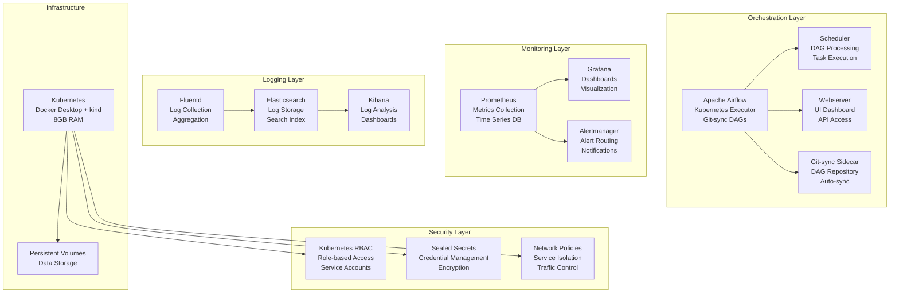

# Orchestration & Monitoring - Design Document

## Overview

This document describes the design for orchestration and monitoring capabilities that coordinate the data pipeline components and provide comprehensive observability. The system includes Apache Airflow for workflow orchestration, comprehensive monitoring with Prometheus and Grafana, security controls, and operational procedures.

The architecture focuses on operational excellence and system reliability:
- **Workflow Orchestration**: Apache Airflow with git-sync for DAG management
- **Monitoring Stack**: Prometheus, Grafana, and centralized logging
- **Alerting System**: Intelligent alerting with escalation procedures
- **Security Controls**: RBAC, network policies, and credential management
- **Operational Procedures**: Backup, disaster recovery, and capacity planning

## Architecture

### High-Level Architecture Diagram



### Data Flow Architecture

#### Orchestration Flow
1. **DAG Synchronization**: Git-sync pulls DAGs from repository every 60 seconds
2. **Task Scheduling**: Airflow scheduler processes DAGs and schedules tasks
3. **Task Execution**: Kubernetes executor creates pods for task execution
4. **Dependency Management**: Complex workflows managed through task dependencies
5. **Monitoring Integration**: All workflow metrics collected by Prometheus

#### Monitoring Flow
1. **Metrics Collection**: Prometheus scrapes metrics from all pipeline components
2. **Log Aggregation**: Fluentd collects logs from all pods and services
3. **Data Storage**: Metrics stored in Prometheus, logs in Elasticsearch
4. **Visualization**: Grafana dashboards provide real-time system visibility
5. **Alerting**: Alertmanager processes alerts and sends notifications

## Components and Interfaces

### Apache Airflow (Workflow Orchestration)

**Purpose**: Schedule and monitor batch processing workflows
**Configuration**:
```yaml
airflow:
  scheduler:
    resources:
      requests: { memory: "1Gi", cpu: "500m" }
      limits: { memory: "2Gi", cpu: "1000m" }
    config:
      AIRFLOW__SCHEDULER__DAG_DIR_LIST_INTERVAL: 60
      AIRFLOW__SCHEDULER__CATCHUP_BY_DEFAULT: "False"
      AIRFLOW__SCHEDULER__MAX_THREADS: 4
  
  webserver:
    resources:
      requests: { memory: "1Gi", cpu: "500m" }
      limits: { memory: "2Gi", cpu: "1000m" }
    config:
      AIRFLOW__WEBSERVER__WORKERS: 2
      AIRFLOW__WEBSERVER__WORKER_TIMEOUT: 120
  
  executor:
    type: "KubernetesExecutor"
    config:
      AIRFLOW__KUBERNETES__NAMESPACE: "airflow"
      AIRFLOW__KUBERNETES__WORKER_CONTAINER_REPOSITORY: "apache/airflow"
      AIRFLOW__KUBERNETES__WORKER_CONTAINER_TAG: "2.7.0"
      AIRFLOW__KUBERNETES__DELETE_WORKER_PODS: "True"
```

**Git-sync Sidecar Configuration**:
```yaml
apiVersion: apps/v1
kind: Deployment
metadata:
  name: airflow-scheduler
spec:
  template:
    spec:
      containers:
      - name: airflow-scheduler
        image: apache/airflow:2.7.0
        volumeMounts:
        - name: dags-volume
          mountPath: /opt/airflow/dags
        env:
        - name: AIRFLOW__SCHEDULER__DAG_DIR_LIST_INTERVAL
          value: "60"
      
      - name: git-sync
        image: k8s.gcr.io/git-sync/git-sync:v3.6.3
        env:
        - name: GIT_SYNC_REPO
          value: "https://github.com/company/airflow-dags.git"
        - name: GIT_SYNC_BRANCH
          value: "main"
        - name: GIT_SYNC_ROOT
          value: "/git"
        - name: GIT_SYNC_DEST
          value: "dags"
        - name: GIT_SYNC_WAIT
          value: "60"
        - name: GIT_SYNC_MAX_SYNC_FAILURES
          value: "5"
        volumeMounts:
        - name: dags-volume
          mountPath: /git
        resources:
          requests: { memory: "128Mi", cpu: "100m" }
          limits: { memory: "256Mi", cpu: "200m" }
      
      volumes:
      - name: dags-volume
        emptyDir: {}
```

**Example DAG - Daily Batch Processing**:
```python
from datetime import datetime, timedelta
from airflow import DAG
from airflow.providers.cncf.kubernetes.operators.kubernetes_pod import KubernetesPodOperator
from airflow.providers.postgres.operators.postgres import PostgresOperator
from airflow.operators.python import PythonOperator

default_args = {
    'owner': 'data-engineering',
    'depends_on_past': False,
    'start_date': datetime(2024, 1, 1),
    'email_on_failure': True,
    'email_on_retry': False,
    'retries': 2,
    'retry_delay': timedelta(minutes=5),
    'execution_timeout': timedelta(hours=2)
}

dag = DAG(
    'daily_batch_processing',
    default_args=default_args,
    description='Daily e-commerce batch processing pipeline',
    schedule_interval='@daily',
    catchup=False,
    max_active_runs=1,
    tags=['batch', 'ecommerce', 'daily']
)

# Data quality validation
data_quality_check = KubernetesPodOperator(
    task_id='data_quality_validation',
    name='data-quality-check',
    namespace='airflow',
    image='data-pipeline/quality-checker:latest',
    env_vars={
        'EXECUTION_DATE': '{{ ds }}',
        'S3_BUCKET': 'data-lake-ingestion-datapipe',
        'QUALITY_THRESHOLD': '0.95'
    },
    resources={
        'request_memory': '1Gi',
        'request_cpu': '500m',
        'limit_memory': '2Gi',
        'limit_cpu': '1000m'
    },
    dag=dag
)

# Spark batch processing
spark_batch_job = KubernetesPodOperator(
    task_id='spark_batch_processing',
    name='spark-batch-job',
    namespace='airflow',
    image='data-pipeline/spark-batch:latest',
    env_vars={
        'EXECUTION_DATE': '{{ ds }}',
        'SPARK_MASTER': 'k8s://https://kubernetes.default.svc:443',
        'S3_INPUT_PATH': 's3://data-lake-ingestion-datapipe/{{ ds }}/',
        'SNOWFLAKE_WAREHOUSE': 'COMPUTE_WH'
    },
    resources={
        'request_memory': '2Gi',
        'request_cpu': '1000m',
        'limit_memory': '4Gi',
        'limit_cpu': '2000m'
    },
    dag=dag
)

# dbt transformations
dbt_run = KubernetesPodOperator(
    task_id='dbt_transformations',
    name='dbt-run',
    namespace='airflow',
    image='data-pipeline/dbt-runner:latest',
    env_vars={
        'EXECUTION_DATE': '{{ ds }}',
        'DBT_PROFILES_DIR': '/opt/dbt/profiles',
        'DBT_PROJECT_DIR': '/opt/dbt/project'
    },
    resources={
        'request_memory': '1Gi',
        'request_cpu': '500m',
        'limit_memory': '2Gi',
        'limit_cpu': '1000m'
    },
    dag=dag
)

# Lambda reconciliation
lambda_reconciliation = KubernetesPodOperator(
    task_id='lambda_reconciliation',
    name='lambda-reconciliation',
    namespace='airflow',
    image='data-pipeline/reconciliation:latest',
    env_vars={
        'EXECUTION_DATE': '{{ ds }}',
        'CLICKHOUSE_HOST': 'clickhouse-service',
        'SNOWFLAKE_ACCOUNT': 'your-account.snowflakecomputing.com',
        'TOLERANCE_THRESHOLD': '0.05'
    },
    resources={
        'request_memory': '1Gi',
        'request_cpu': '500m',
        'limit_memory': '2Gi',
        'limit_cpu': '1000m'
    },
    dag=dag
)

# Data quality report
def generate_quality_report(**context):
    execution_date = context['ds']
    # Generate and send data quality report
    print(f"Generating quality report for {execution_date}")

quality_report = PythonOperator(
    task_id='generate_quality_report',
    python_callable=generate_quality_report,
    dag=dag
)

# Task dependencies
data_quality_check >> spark_batch_job >> dbt_run >> lambda_reconciliation >> quality_report
```

### Prometheus (Metrics Collection)

**Purpose**: Time-series metrics collection and storage
**Configuration**:
```yaml
prometheus:
  resources:
    requests: { memory: "2Gi", cpu: "500m" }
    limits: { memory: "4Gi", cpu: "1000m" }
  storage: 10Gi
  retention: "15d"
  config:
    global:
      scrape_interval: 15s
      evaluation_interval: 15s
    
    scrape_configs:
    - job_name: 'kubernetes-pods'
      kubernetes_sd_configs:
      - role: pod
      relabel_configs:
      - source_labels: [__meta_kubernetes_pod_annotation_prometheus_io_scrape]
        action: keep
        regex: true
    
    - job_name: 'airflow'
      static_configs:
      - targets: ['airflow-webserver:8080', 'airflow-scheduler:8793']
    
    - job_name: 'kafka'
      static_configs:
      - targets: ['kafka-0:9308', 'kafka-1:9308', 'kafka-2:9308']
    
    - job_name: 'clickhouse'
      static_configs:
      - targets: ['clickhouse:9363']
    
    - job_name: 'spark'
      kubernetes_sd_configs:
      - role: pod
        namespaces:
          names: ['spark-operator']
```

**Custom Metrics Configuration**:
```yaml
# Pipeline-specific metrics
pipeline_metrics:
  - name: "pipeline_ingestion_rate_records_per_second"
    help: "Rate of records ingested per second"
    type: "gauge"
    labels: ["component", "topic"]
  
  - name: "pipeline_processing_lag_seconds"
    help: "Processing lag in seconds"
    type: "gauge"
    labels: ["layer", "component"]
  
  - name: "data_quality_score"
    help: "Data quality score (0-1)"
    type: "gauge"
    labels: ["checkpoint", "date"]
  
  - name: "lambda_reconciliation_discrepancy"
    help: "Discrepancy between speed and batch layers"
    type: "gauge"
    labels: ["metric", "user_tier"]
```

### Grafana (Visualization and Dashboards)

**Purpose**: Metrics visualization and dashboard creation
**Configuration**:
```yaml
grafana:
  resources:
    requests: { memory: "512Mi", cpu: "250m" }
    limits: { memory: "1Gi", cpu: "500m" }
  config:
    server:
      root_url: "http://localhost:3000"
    security:
      admin_user: "admin"
      admin_password: "${GRAFANA_ADMIN_PASSWORD}"
    auth:
      disable_login_form: false
    datasources:
      - name: "Prometheus"
        type: "prometheus"
        url: "http://prometheus:9090"
        access: "proxy"
        isDefault: true
```

**Dashboard Definitions**:

**Pipeline Overview Dashboard**:
```json
{
  "dashboard": {
    "title": "Data Pipeline Overview",
    "panels": [
      {
        "title": "Ingestion Rate",
        "type": "stat",
        "targets": [
          {
            "expr": "sum(rate(pipeline_ingestion_rate_records_per_second[5m]))",
            "legendFormat": "Records/sec"
          }
        ]
      },
      {
        "title": "Processing Lag",
        "type": "graph",
        "targets": [
          {
            "expr": "pipeline_processing_lag_seconds",
            "legendFormat": "{{layer}} - {{component}}"
          }
        ]
      },
      {
        "title": "Data Quality Score",
        "type": "gauge",
        "targets": [
          {
            "expr": "avg(data_quality_score)",
            "legendFormat": "Quality Score"
          }
        ]
      },
      {
        "title": "Lambda Reconciliation",
        "type": "heatmap",
        "targets": [
          {
            "expr": "lambda_reconciliation_discrepancy",
            "legendFormat": "{{metric}}"
          }
        ]
      }
    ]
  }
}
```

**Component Health Dashboard**:
```json
{
  "dashboard": {
    "title": "Component Health",
    "panels": [
      {
        "title": "Kafka Cluster Health",
        "type": "table",
        "targets": [
          {
            "expr": "kafka_server_replicamanager_leadercount",
            "legendFormat": "Leader Count"
          },
          {
            "expr": "kafka_server_replicamanager_partitioncount",
            "legendFormat": "Partition Count"
          }
        ]
      },
      {
        "title": "ClickHouse Performance",
        "type": "graph",
        "targets": [
          {
            "expr": "clickhouse_query_duration_seconds",
            "legendFormat": "Query Duration"
          },
          {
            "expr": "clickhouse_insert_rate",
            "legendFormat": "Insert Rate"
          }
        ]
      },
      {
        "title": "Spark Job Status",
        "type": "stat",
        "targets": [
          {
            "expr": "spark_streaming_batch_duration_seconds",
            "legendFormat": "Batch Duration"
          }
        ]
      }
    ]
  }
}
```

### Alertmanager (Alert Management)

**Purpose**: Alert routing and notification management
**Configuration**:
```yaml
alertmanager:
  resources:
    requests: { memory: "256Mi", cpu: "100m" }
    limits: { memory: "512Mi", cpu: "200m" }
  config:
    global:
      smtp_smarthost: 'localhost:587'
      smtp_from: 'alerts@company.com'
    
    route:
      group_by: ['alertname', 'severity']
      group_wait: 30s
      group_interval: 5m
      repeat_interval: 12h
      receiver: 'default'
      routes:
      - match:
          severity: critical
        receiver: 'critical-alerts'
      - match:
          severity: warning
        receiver: 'warning-alerts'
    
    receivers:
    - name: 'default'
      email_configs:
      - to: 'team@company.com'
        subject: 'Data Pipeline Alert'
    
    - name: 'critical-alerts'
      email_configs:
      - to: 'oncall@company.com'
        subject: 'CRITICAL: Data Pipeline Alert'
      slack_configs:
      - api_url: '${SLACK_WEBHOOK_URL}'
        channel: '#data-alerts'
        title: 'Critical Pipeline Alert'
    
    - name: 'warning-alerts'
      email_configs:
      - to: 'team@company.com'
        subject: 'WARNING: Data Pipeline Alert'
```

**Alert Rules**:
```yaml
groups:
- name: pipeline.rules
  rules:
  - alert: HighIngestionLag
    expr: pipeline_processing_lag_seconds{layer="ingestion"} > 300
    for: 5m
    labels:
      severity: warning
    annotations:
      summary: "High ingestion lag detected"
      description: "Ingestion lag is {{ $value }} seconds for {{ $labels.component }}"
  
  - alert: DataQualityDegraded
    expr: data_quality_score < 0.95
    for: 2m
    labels:
      severity: warning
    annotations:
      summary: "Data quality score below threshold"
      description: "Data quality score is {{ $value }} for {{ $labels.checkpoint }}"
  
  - alert: LambdaReconciliationFailure
    expr: lambda_reconciliation_discrepancy > 0.1
    for: 10m
    labels:
      severity: critical
    annotations:
      summary: "High discrepancy between speed and batch layers"
      description: "Discrepancy of {{ $value }} detected for {{ $labels.metric }}"
  
  - alert: AirflowDAGFailure
    expr: airflow_dag_run_failed > 0
    for: 1m
    labels:
      severity: critical
    annotations:
      summary: "Airflow DAG execution failed"
      description: "DAG {{ $labels.dag_id }} failed execution"
  
  - alert: ComponentDown
    expr: up == 0
    for: 1m
    labels:
      severity: critical
    annotations:
      summary: "Component is down"
      description: "{{ $labels.job }} component is not responding"
```

### Centralized Logging

**Purpose**: Collect, aggregate, and analyze logs from all components
**Configuration**:

**Fluentd DaemonSet**:
```yaml
apiVersion: apps/v1
kind: DaemonSet
metadata:
  name: fluentd
spec:
  template:
    spec:
      containers:
      - name: fluentd
        image: fluent/fluentd-kubernetes-daemonset:v1.16-debian-elasticsearch7-1
        resources:
          requests: { memory: "200Mi", cpu: "100m" }
          limits: { memory: "400Mi", cpu: "200m" }
        env:
        - name: FLUENT_ELASTICSEARCH_HOST
          value: "elasticsearch"
        - name: FLUENT_ELASTICSEARCH_PORT
          value: "9200"
        - name: FLUENT_ELASTICSEARCH_SCHEME
          value: "http"
        volumeMounts:
        - name: varlog
          mountPath: /var/log
        - name: varlibdockercontainers
          mountPath: /var/lib/docker/containers
          readOnly: true
        - name: fluentd-config
          mountPath: /fluentd/etc/fluent.conf
          subPath: fluent.conf
      volumes:
      - name: varlog
        hostPath:
          path: /var/log
      - name: varlibdockercontainers
        hostPath:
          path: /var/lib/docker/containers
      - name: fluentd-config
        configMap:
          name: fluentd-config
```

**Elasticsearch Configuration**:
```yaml
elasticsearch:
  resources:
    requests: { memory: "1Gi", cpu: "500m" }
    limits: { memory: "2Gi", cpu: "1000m" }
  storage: 10Gi
  config:
    cluster.name: "data-pipeline-logs"
    node.name: "elasticsearch-0"
    discovery.type: "single-node"
    xpack.security.enabled: false
```

## Security Architecture

### Kubernetes RBAC

**Service Accounts and Roles**:
```yaml
# Airflow service account
apiVersion: v1
kind: ServiceAccount
metadata:
  name: airflow
  namespace: airflow
---
apiVersion: rbac.authorization.k8s.io/v1
kind: Role
metadata:
  name: airflow-role
  namespace: airflow
rules:
- apiGroups: [""]
  resources: ["pods", "pods/log"]
  verbs: ["create", "get", "list", "watch", "delete"]
- apiGroups: [""]
  resources: ["secrets", "configmaps"]
  verbs: ["get", "list"]
---
apiVersion: rbac.authorization.k8s.io/v1
kind: RoleBinding
metadata:
  name: airflow-rolebinding
  namespace: airflow
subjects:
- kind: ServiceAccount
  name: airflow
  namespace: airflow
roleRef:
  kind: Role
  name: airflow-role
  apiGroup: rbac.authorization.k8s.io

# Monitoring service account
apiVersion: v1
kind: ServiceAccount
metadata:
  name: prometheus
  namespace: monitoring
---
apiVersion: rbac.authorization.k8s.io/v1
kind: ClusterRole
metadata:
  name: prometheus-role
rules:
- apiGroups: [""]
  resources: ["nodes", "nodes/proxy", "services", "endpoints", "pods"]
  verbs: ["get", "list", "watch"]
- apiGroups: ["extensions"]
  resources: ["ingresses"]
  verbs: ["get", "list", "watch"]
```

### Network Policies

**Service Isolation**:
```yaml
# Airflow network policy
apiVersion: networking.k8s.io/v1
kind: NetworkPolicy
metadata:
  name: airflow-network-policy
  namespace: airflow
spec:
  podSelector:
    matchLabels:
      app: airflow
  policyTypes:
  - Ingress
  - Egress
  ingress:
  - from:
    - namespaceSelector:
        matchLabels:
          name: monitoring
    ports:
    - protocol: TCP
      port: 8080
  egress:
  - to:
    - namespaceSelector:
        matchLabels:
          name: data-pipeline
    ports:
    - protocol: TCP
      port: 9092  # Kafka
    - protocol: TCP
      port: 8123  # ClickHouse

# Monitoring network policy
apiVersion: networking.k8s.io/v1
kind: NetworkPolicy
metadata:
  name: monitoring-network-policy
  namespace: monitoring
spec:
  podSelector:
    matchLabels:
      app: prometheus
  policyTypes:
  - Ingress
  - Egress
  ingress:
  - from: []  # Allow from all namespaces for metrics collection
  egress:
  - to: []    # Allow to all namespaces for metrics scraping
```

### Sealed Secrets

**Credential Management**:
```yaml
# Sealed secret for database credentials
apiVersion: bitnami.com/v1alpha1
kind: SealedSecret
metadata:
  name: database-credentials
  namespace: airflow
spec:
  encryptedData:
    postgres_user: AgBy3i4OJSWK+PiTySYZZA9rO43cGDEQAx...
    postgres_password: AgBy3i4OJSWK+PiTySYZZA9rO43cGDEQAx...
    clickhouse_user: AgBy3i4OJSWK+PiTySYZZA9rO43cGDEQAx...
    clickhouse_password: AgBy3i4OJSWK+PiTySYZZA9rO43cGDEQAx...
    snowflake_user: AgBy3i4OJSWK+PiTySYZZA9rO43cGDEQAx...
    snowflake_password: AgBy3i4OJSWK+PiTySYZZA9rO43cGDEQAx...
    snowflake_account: AgBy3i4OJSWK+PiTySYZZA9rO43cGDEQAx...

# Sealed secret for AWS credentials
apiVersion: bitnami.com/v1alpha1
kind: SealedSecret
metadata:
  name: aws-credentials
  namespace: airflow
spec:
  encryptedData:
    access_key_id: AgBy3i4OJSWK+PiTySYZZA9rO43cGDEQAx...
    secret_access_key: AgBy3i4OJSWK+PiTySYZZA9rO43cGDEQAx...
```

## Backup and Disaster Recovery

### Backup Strategy

**Automated Backup Configuration**:
```yaml
# Velero backup configuration
apiVersion: velero.io/v1
kind: Schedule
metadata:
  name: daily-backup
spec:
  schedule: "0 2 * * *"  # Daily at 2 AM
  template:
    includedNamespaces:
    - airflow
    - monitoring
    - data-pipeline
    excludedResources:
    - pods
    - replicasets
    storageLocation: default
    ttl: 720h  # 30 days retention

# Database backup job
apiVersion: batch/v1
kind: CronJob
metadata:
  name: postgres-backup
spec:
  schedule: "0 3 * * *"  # Daily at 3 AM
  jobTemplate:
    spec:
      template:
        spec:
          containers:
          - name: postgres-backup
            image: postgres:13
            command:
            - /bin/bash
            - -c
            - |
              pg_dump -h postgresql -U postgres -d ecommerce | \
              gzip > /backup/postgres-$(date +%Y%m%d).sql.gz
              aws s3 cp /backup/postgres-$(date +%Y%m%d).sql.gz \
              s3://backup-bucket/postgres/
            env:
            - name: PGPASSWORD
              valueFrom:
                secretKeyRef:
                  name: database-credentials
                  key: postgres_password
            volumeMounts:
            - name: backup-volume
              mountPath: /backup
          volumes:
          - name: backup-volume
            emptyDir: {}
          restartPolicy: OnFailure
```

### Disaster Recovery Procedures

**Recovery Runbook**:
```yaml
disaster_recovery:
  rto: 4 hours  # Recovery Time Objective
  rpo: 1 hour   # Recovery Point Objective
  
  procedures:
    - name: "Complete Cluster Failure"
      steps:
        - "Create new kind cluster"
        - "Restore from Velero backup"
        - "Restore database from S3 backup"
        - "Verify data integrity"
        - "Resume pipeline operations"
    
    - name: "Database Corruption"
      steps:
        - "Stop all data ingestion"
        - "Restore database from latest backup"
        - "Replay CDC events from Kafka"
        - "Validate data consistency"
        - "Resume operations"
    
    - name: "Monitoring System Failure"
      steps:
        - "Deploy monitoring stack from backup"
        - "Restore Grafana dashboards"
        - "Verify alert routing"
        - "Test notification channels"
```

## Performance and Scalability

### Resource Allocation (8GB Total)
```yaml
resource_allocation:
  airflow_scheduler: 2GB RAM, 1 CPU
  airflow_webserver: 2GB RAM, 1 CPU
  prometheus: 2GB RAM, 0.5 CPU
  grafana: 1GB RAM, 0.5 CPU
  elasticsearch: 1GB RAM, 0.5 CPU
  total: 8GB RAM, 3.5 CPU
```

### Performance Optimization

**Airflow Tuning**:
```python
# airflow.cfg optimizations
[scheduler]
dag_dir_list_interval = 60
max_threads = 4
catchup_by_default = False
max_active_runs_per_dag = 1

[webserver]
workers = 2
worker_timeout = 120
web_server_worker_timeout = 120

[kubernetes]
delete_worker_pods = True
worker_container_repository = apache/airflow
worker_container_tag = 2.7.0
```

**Monitoring Stack Optimization**:
```yaml
# Prometheus retention and storage optimization
prometheus:
  retention: "15d"
  storage:
    tsdb:
      retention_size: "8GB"
      wal_compression: true
  
# Grafana performance settings
grafana:
  database:
    type: sqlite3
    cache_mode: private
  dashboards:
    default_home_dashboard_path: "/var/lib/grafana/dashboards/overview.json"
```

This design provides a comprehensive orchestration and monitoring solution that ensures operational excellence, system reliability, and comprehensive observability across the entire data pipeline ecosystem.