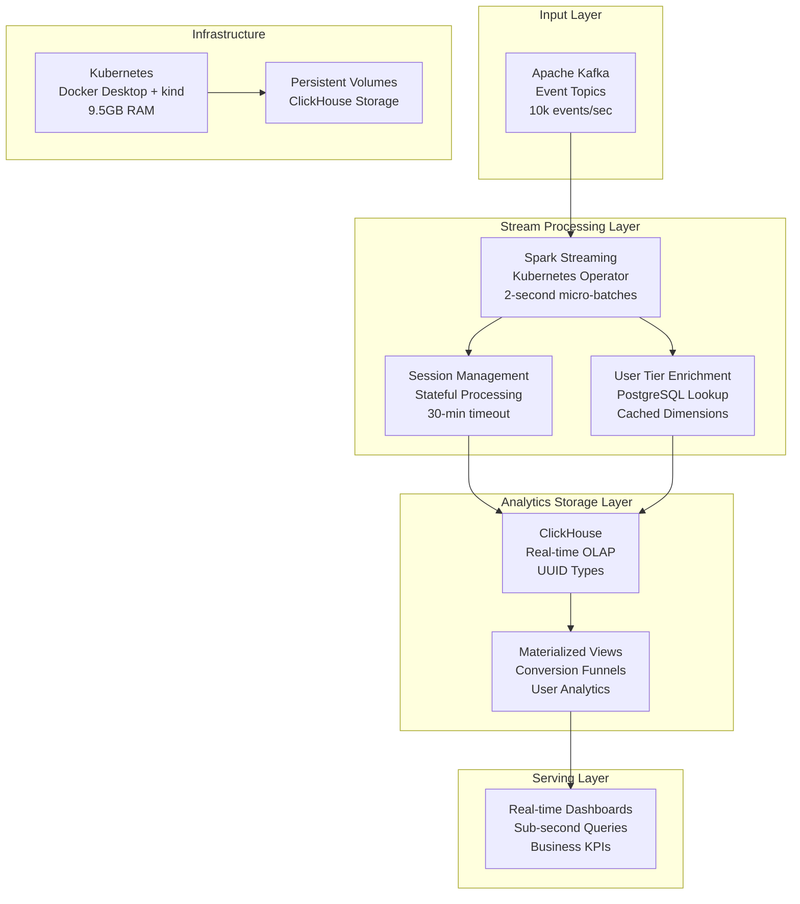

# Real-time Analytics Speed Layer - Design Document

## Overview

This document describes the design for a real-time analytics speed layer that processes streaming data from Kafka using Spark Streaming and stores results in ClickHouse for sub-second analytics. The system is designed to handle 10,000 events per second while providing real-time insights for operational dashboards and e-commerce analytics.

The architecture follows Lambda Architecture principles with focus on low-latency processing:
- **Stream Processing**: Spark Streaming with micro-batching for real-time data processing
- **Analytics Storage**: ClickHouse optimized for high-throughput writes and fast queries
- **Business Logic**: E-commerce event processing with user tier analytics and session management

## Architecture

### High-Level Architecture Diagram



### Data Flow Architecture

#### Stream Processing Flow
1. **Event Consumption**: Spark Streaming consumes from Kafka topics with 2-second micro-batches
2. **Schema Validation**: Events validated against JSON schemas with error handling
3. **Session Management**: Stateful processing tracks user sessions with 30-minute timeouts
4. **User Enrichment**: Events enriched with user tier information from cached PostgreSQL data
5. **Real-time Storage**: Processed events written to ClickHouse with batch optimization

#### Analytics Flow
1. **Event Storage**: Raw events stored in ClickHouse with proper data types and partitioning
2. **Materialized Views**: Real-time aggregations for conversion funnels and user analytics
3. **Query Optimization**: ClickHouse optimized for both high-throughput writes and fast reads
4. **Dashboard Serving**: Sub-second query responses for operational dashboards
5. **Business Intelligence**: Real-time KPIs and e-commerce metrics

## Components and Interfaces

### Spark Streaming (Stream Processing Engine)

**Purpose**: Real-time stream processing with micro-batching
**Configuration**:
```yaml
spark:
  driver:
    resources:
      requests: { memory: "512Mi", cpu: "500m" }
      limits: { memory: "1Gi", cpu: "1000m" }
  executor:
    instances: 1
    resources:
      requests: { memory: "1Gi", cpu: "1000m" }
      limits: { memory: "1.5Gi", cpu: "1500m" }
  config:
    spark.streaming.batchDuration: "2s"
    spark.streaming.backpressure.enabled: "true"
    spark.streaming.kafka.maxRatePerPartition: "1000"
    spark.sql.streaming.checkpointLocation: "s3://checkpoints/speed-layer/"
    spark.sql.adaptive.enabled: "true"
    spark.serializer: "org.apache.spark.serializer.KryoSerializer"
```

**Application Structure**:
```scala
object SpeedLayerApp extends App {
  val spark = SparkSession.builder()
    .appName("EcommerceSpeedLayer")
    .config("spark.sql.streaming.checkpointLocation", checkpointLocation)
    .getOrCreate()
  
  import spark.implicits._
  
  // Read from Kafka
  val kafkaStream = spark
    .readStream
    .format("kafka")
    .option("kafka.bootstrap.servers", "kafka-0:9092,kafka-1:9092,kafka-2:9092")
    .option("subscribe", "user_events,transactions")
    .option("startingOffsets", "latest")
    .load()
  
  // Parse and validate events
  val parsedEvents = kafkaStream
    .select(
      col("topic"),
      col("partition"),
      col("offset"),
      col("timestamp"),
      from_json(col("value").cast("string"), eventSchema).as("event")
    )
    .filter(col("event").isNotNull)
  
  // Session management with stateful processing
  val sessionizedEvents = parsedEvents
    .groupByKey(event => event.getAs[String]("user_id"))
    .flatMapGroupsWithState(
      outputMode = OutputMode.Update(),
      timeoutConf = GroupStateTimeout.ProcessingTimeTimeout()
    )(updateSessionState)
  
  // Write to ClickHouse
  val query = sessionizedEvents
    .writeStream
    .outputMode("update")
    .foreachBatch(writeToClickHouse _)
    .start()
  
  query.awaitTermination()
}
```

### ClickHouse (Real-time Analytics Database)

**Purpose**: High-performance OLAP database for real-time analytics
**Configuration**:
```yaml
clickhouse:
  resources:
    requests: { memory: "5Gi", cpu: "2000m" }
    limits: { memory: "7Gi", cpu: "3000m" }
  storage: 20Gi
  config:
    max_memory_usage: 6000000000  # 6GB for queries (1GB reserved for system)
    max_threads: 8
    max_concurrent_queries: 50  # Reduced for memory optimization
    keep_alive_timeout: 3
    # Memory optimization for 7GB allocation
    max_memory_usage_for_user: 5000000000
    max_memory_usage_for_all_queries: 5500000000
    # Query performance optimization
    use_uncompressed_cache: 1
    uncompressed_cache_size: 1073741824  # 1GB uncompressed cache
```

**Database Schema**:
```sql
-- Main events table for all event types
CREATE TABLE user_events_realtime (
    event_id UUID,
    user_id UUID,
    session_id UUID,
    event_type LowCardinality(String),
    timestamp DateTime64(3),
    device_type LowCardinality(String),
    browser LowCardinality(String),
    ip_address IPv4,
    
    -- Event-specific fields (nullable for different event types)
    page_url Nullable(String),
    product_id Nullable(String),
    search_query Nullable(String),
    transaction_id Nullable(UUID),
    
    -- User enrichment data
    user_tier LowCardinality(String),
    
    -- Properties as JSON for flexibility
    properties String,
    
    -- Processing metadata
    processing_time DateTime64(3) DEFAULT now64(),
    batch_id String
) ENGINE = ReplicatedMergeTree()
ORDER BY (timestamp, event_type, user_id)
PARTITION BY toYYYYMM(timestamp)
SETTINGS index_granularity = 8192;

-- Transactions table for purchase events
CREATE TABLE transactions_realtime (
    transaction_id UUID,
    user_id UUID,
    product_id UUID,
    quantity UInt32,
    unit_price Decimal(10,2),
    total_amount Decimal(10,2),
    discount_amount Decimal(10,2),
    tax_amount Decimal(10,2),
    status LowCardinality(String),
    payment_method LowCardinality(String),
    user_tier LowCardinality(String),
    created_at DateTime64(3),
    processing_time DateTime64(3) DEFAULT now64()
) ENGINE = ReplicatedMergeTree()
ORDER BY (created_at, user_id, transaction_id)
PARTITION BY toYYYYMM(created_at)
SETTINGS index_granularity = 8192;

-- User sessions table for session analytics
CREATE TABLE user_sessions_realtime (
    session_id UUID,
    user_id UUID,
    user_tier LowCardinality(String),
    session_start DateTime64(3),
    session_end DateTime64(3),
    session_duration_minutes UInt32,
    
    -- Activity metrics
    page_views UInt32,
    product_views UInt32,
    searches UInt32,
    add_to_cart_events UInt32,
    purchases UInt32,
    
    -- Business metrics
    total_spent Decimal(10,2),
    items_purchased UInt32,
    
    -- Session context
    device_type LowCardinality(String),
    browser LowCardinality(String),
    
    -- Conversion flags
    converted_to_purchase Boolean,
    
    processing_time DateTime64(3) DEFAULT now64()
) ENGINE = ReplicatedMergeTree()
ORDER BY (session_start, user_id, session_id)
PARTITION BY toYYYYMM(session_start)
SETTINGS index_granularity = 8192;
```

**Materialized Views for Real-time Analytics**:
```sql
-- Real-time conversion funnel view
CREATE MATERIALIZED VIEW conversion_funnel_mv
ENGINE = SummingMergeTree()
ORDER BY (date, user_tier, hour)
AS SELECT
    toDate(timestamp) as date,
    toHour(timestamp) as hour,
    user_tier,
    countIf(event_type = 'page_view') as page_views,
    countIf(event_type = 'product_view') as product_views,
    countIf(event_type = 'add_to_cart') as add_to_carts,
    countIf(event_type = 'checkout_start') as checkout_starts,
    countIf(event_type = 'purchase') as purchases,
    uniq(user_id) as unique_users,
    uniq(session_id) as unique_sessions
FROM user_events_realtime
GROUP BY date, hour, user_tier;

-- User tier performance view
CREATE MATERIALIZED VIEW user_tier_performance_mv
ENGINE = SummingMergeTree()
ORDER BY (date, user_tier)
AS SELECT
    toDate(timestamp) as date,
    user_tier,
    count() as total_events,
    uniq(user_id) as active_users,
    uniq(session_id) as sessions,
    countIf(event_type = 'purchase') as purchases,
    avgIf(toFloat64(JSONExtractFloat(properties, 'amount')), event_type = 'purchase') as avg_order_value
FROM user_events_realtime
GROUP BY date, user_tier;

-- Product performance view
CREATE MATERIALIZED VIEW product_performance_mv
ENGINE = SummingMergeTree()
ORDER BY (date, product_id)
AS SELECT
    toDate(timestamp) as date,
    product_id,
    countIf(event_type = 'product_view') as views,
    countIf(event_type = 'add_to_cart') as add_to_carts,
    countIf(event_type = 'purchase') as purchases,
    uniq(user_id) as unique_viewers,
    uniq(session_id) as unique_sessions
FROM user_events_realtime
WHERE product_id IS NOT NULL
GROUP BY date, product_id;
```

### Session Management (Stateful Processing)

**Purpose**: Track user sessions with stateful stream processing
**Implementation**:
```scala
case class SessionState(
  sessionId: String,
  userId: String,
  sessionStart: Timestamp,
  lastActivity: Timestamp,
  eventCount: Int,
  pageViews: Int,
  productViews: Int,
  searches: Int,
  addToCarts: Int,
  purchases: Int,
  totalSpent: Double,
  deviceType: String,
  browser: String,
  userTier: String
)

def updateSessionState(
  userId: String,
  events: Iterator[Event],
  state: GroupState[SessionState]
): Iterator[SessionOutput] = {
  
  val sessionTimeout = 30 * 60 * 1000 // 30 minutes in milliseconds
  
  // Handle timeout
  if (state.hasTimedOut) {
    val finalSession = state.get
    state.remove()
    return Iterator(SessionOutput.fromState(finalSession, isComplete = true))
  }
  
  val currentState = state.getOption.getOrElse(
    SessionState(
      sessionId = UUID.randomUUID().toString,
      userId = userId,
      sessionStart = new Timestamp(System.currentTimeMillis()),
      lastActivity = new Timestamp(System.currentTimeMillis()),
      eventCount = 0,
      pageViews = 0,
      productViews = 0,
      searches = 0,
      addToCarts = 0,
      purchases = 0,
      totalSpent = 0.0,
      deviceType = "",
      browser = "",
      userTier = ""
    )
  )
  
  val updatedState = events.foldLeft(currentState) { (session, event) =>
    session.copy(
      lastActivity = event.timestamp,
      eventCount = session.eventCount + 1,
      pageViews = session.pageViews + (if (event.eventType == "page_view") 1 else 0),
      productViews = session.productViews + (if (event.eventType == "product_view") 1 else 0),
      searches = session.searches + (if (event.eventType == "search") 1 else 0),
      addToCarts = session.addToCarts + (if (event.eventType == "add_to_cart") 1 else 0),
      purchases = session.purchases + (if (event.eventType == "purchase") 1 else 0),
      totalSpent = session.totalSpent + (if (event.eventType == "purchase") event.amount.getOrElse(0.0) else 0.0),
      deviceType = if (session.deviceType.isEmpty) event.deviceType else session.deviceType,
      browser = if (session.browser.isEmpty) event.browser else session.browser,
      userTier = if (session.userTier.isEmpty) event.userTier.getOrElse("unknown") else session.userTier
    )
  }
  
  state.update(updatedState)
  state.setTimeoutDuration(sessionTimeout)
  
  Iterator(SessionOutput.fromState(updatedState, isComplete = false))
}
```

### User Tier Enrichment

**Purpose**: Enrich events with user tier information from PostgreSQL
**Implementation**:
```scala
class UserTierEnrichment(postgresConfig: PostgresConfig) extends Serializable {
  
  @transient lazy val connectionPool = createConnectionPool(postgresConfig)
  @transient lazy val userTierCache = CacheBuilder.newBuilder()
    .maximumSize(100000)
    .expireAfterWrite(15, TimeUnit.MINUTES)
    .build[String, String]()
  
  def enrichWithUserTier(events: Dataset[Event]): Dataset[EnrichedEvent] = {
    events.map { event =>
      val userTier = getUserTier(event.userId)
      event.copy(userTier = Some(userTier))
    }
  }
  
  private def getUserTier(userId: String): String = {
    Option(userTierCache.getIfPresent(userId)) match {
      case Some(tier) => tier
      case None =>
        val tier = fetchUserTierFromDB(userId)
        userTierCache.put(userId, tier)
        tier
    }
  }
  
  private def fetchUserTierFromDB(userId: String): String = {
    using(connectionPool.getConnection()) { conn =>
      val stmt = conn.prepareStatement(
        "SELECT tier FROM users WHERE user_id = ? AND is_active = true"
      )
      stmt.setString(1, userId)
      val rs = stmt.executeQuery()
      if (rs.next()) {
        rs.getString("tier")
      } else {
        "unknown" // Default tier for missing users
      }
    }
  }
}
```

## Data Models

### Event Schema Design

**Base Event Schema**:
```json
{
  "type": "object",
  "properties": {
    "event_id": {"type": "string", "format": "uuid"},
    "user_id": {"type": "string", "format": "uuid"},
    "session_id": {"type": "string", "format": "uuid"},
    "event_type": {
      "type": "string",
      "enum": ["page_view", "product_view", "search", "add_to_cart", "purchase", "remove_from_cart", "checkout_start", "login", "logout"]
    },
    "timestamp": {"type": "string", "format": "date-time"},
    "device_type": {"type": "string"},
    "browser": {"type": "string"},
    "ip_address": {"type": "string", "format": "ipv4"},
    "page_url": {"type": "string"},
    "product_id": {"type": "string", "format": "uuid"},
    "search_query": {"type": "string"},
    "transaction_id": {"type": "string", "format": "uuid"},
    "properties": {"type": "object"},
    "user_tier": {"type": "string", "enum": ["bronze", "silver", "gold", "platinum", "unknown"]}
  },
  "required": ["event_id", "user_id", "session_id", "event_type", "timestamp"]
}
```

**Session Output Schema**:
```json
{
  "type": "object",
  "properties": {
    "session_id": {"type": "string", "format": "uuid"},
    "user_id": {"type": "string", "format": "uuid"},
    "user_tier": {"type": "string"},
    "session_start": {"type": "string", "format": "date-time"},
    "session_end": {"type": "string", "format": "date-time"},
    "session_duration_minutes": {"type": "integer"},
    "page_views": {"type": "integer"},
    "product_views": {"type": "integer"},
    "searches": {"type": "integer"},
    "add_to_cart_events": {"type": "integer"},
    "purchases": {"type": "integer"},
    "total_spent": {"type": "number"},
    "items_purchased": {"type": "integer"},
    "device_type": {"type": "string"},
    "browser": {"type": "string"},
    "converted_to_purchase": {"type": "boolean"},
    "is_complete": {"type": "boolean"}
  }
}
```

## Error Handling

### Stream Processing Error Handling

**1. Schema Validation Errors**:
```scala
val validatedEvents = parsedEvents
  .filter(col("event").isNotNull)
  .withColumn("validation_errors", validateSchema(col("event")))
  .cache()

val validEvents = validatedEvents.filter(col("validation_errors").isNull)
val invalidEvents = validatedEvents.filter(col("validation_errors").isNotNull)

// Send invalid events to DLQ
invalidEvents
  .select(to_json(struct("*")).as("value"))
  .writeStream
  .format("kafka")
  .option("kafka.bootstrap.servers", kafkaBootstrapServers)
  .option("topic", "speed-layer-dlq")
  .option("checkpointLocation", s"$checkpointLocation/dlq")
  .start()
```

**2. ClickHouse Write Errors**:
```scala
def writeToClickHouse(df: DataFrame, batchId: Long): Unit = {
  try {
    df.write
      .format("jdbc")
      .option("url", clickhouseUrl)
      .option("dbtable", "user_events_realtime")
      .option("user", clickhouseUser)
      .option("password", clickhousePassword)
      .option("batchsize", "10000")
      .option("isolationLevel", "NONE")
      .mode("append")
      .save()
  } catch {
    case e: Exception =>
      logger.error(s"Failed to write batch $batchId to ClickHouse", e)
      // Write failed batch to error topic for retry
      df.select(to_json(struct("*")).as("value"))
        .write
        .format("kafka")
        .option("kafka.bootstrap.servers", kafkaBootstrapServers)
        .option("topic", "clickhouse-retry")
        .save()
      throw e
  }
}
```

### Monitoring and Alerting

**Key Metrics**:
```yaml
metrics:
  - name: "spark_streaming_batch_duration"
    type: "histogram"
    labels: ["application", "batch_id"]
  - name: "clickhouse_insert_rate"
    type: "gauge"
    labels: ["table", "partition"]
  - name: "session_state_size"
    type: "gauge"
    labels: ["application"]
  - name: "user_tier_cache_hit_rate"
    type: "gauge"
    labels: ["cache_type"]
```

**Alert Rules**:
```yaml
alerts:
  - name: "SparkStreamingLag"
    condition: "spark_streaming_batch_duration > 5"
    severity: "warning"
    duration: "2m"
  - name: "ClickHouseWriteFailures"
    condition: "rate(clickhouse_write_errors[5m]) > 0"
    severity: "critical"
    duration: "1m"
  - name: "SessionStateMemoryUsage"
    condition: "session_state_size > 1000000"
    severity: "warning"
    duration: "5m"
```

## Dynamic Resource Pooling Architecture

### Shared Spark Resource Pool (7GB Total)
```yaml
dynamic_resource_pool:
  total_pool_size: 7GB
  speed_layer_guaranteed: 2.5GB
  batch_layer_flexible: 4.5GB
  
  resource_manager: kubernetes
  priority_queues:
    - name: "streaming"
      priority: high
      guaranteed_resources: 2.5GB
      max_resources: 7GB
    - name: "batch"
      priority: normal
      guaranteed_resources: 0GB
      max_resources: 4.5GB
  
  scaling_policy:
    scale_up_threshold: 80%
    scale_down_threshold: 20%
    evaluation_interval: 30s
```

### Container Orchestration Requirements
```yaml
container_limits:
  clickhouse:
    memory: "7Gi"
    memory_request: "5Gi"
    memory_limit_enforcement: true
    query_memory_optimization: true
  spark_streaming:
    memory: "2.5Gi"  # Guaranteed allocation
    memory_request: "1Gi"
    dynamic_scaling: true
    max_memory: "7Gi"  # Can scale into batch pool
  spark_batch:
    memory: "4.5Gi"  # Flexible allocation
    memory_request: "0Gi"
    dynamic_scaling: true
    preemptible: true
```

### Integration with Data Ingestion
```yaml
kafka_integration:
  shared_cluster_allocation: 2GB
  consumer_optimization:
    fetch_min_bytes: 1048576
    fetch_max_wait_ms: 500
    max_poll_records: 1000
  backpressure_handling:
    enabled: true
    initial_rate: 1000
    max_rate: 10000
```

## Performance and Scalability

### Resource Allocation (9.5GB Total)
```yaml
resource_allocation:
  spark_driver: 1GB RAM, 1 CPU
  spark_executors: 1.5GB RAM (single executor), 1.5 CPU
  clickhouse: 7GB RAM, 3 CPU
  total: 9.5GB RAM, 5.5 CPU
```

### Performance Optimization

**Spark Streaming Tuning**:
```properties
# Batch processing optimization
spark.streaming.batchDuration=2s
spark.streaming.backpressure.enabled=true
spark.streaming.kafka.maxRatePerPartition=1000
spark.streaming.concurrentJobs=2

# Memory optimization
spark.executor.memory=2g
spark.executor.memoryFraction=0.8
spark.executor.cores=1
spark.sql.adaptive.enabled=true
```

**ClickHouse Optimization**:
```sql
-- Optimize table settings for high-throughput writes
ALTER TABLE user_events_realtime MODIFY SETTING
    max_insert_block_size = 1048576,
    min_insert_block_size_rows = 262144,
    min_insert_block_size_bytes = 268435456;

-- Optimize materialized views
ALTER TABLE conversion_funnel_mv MODIFY SETTING
    optimize_on_insert = 1;
```

This design provides a robust, high-performance real-time analytics speed layer that can handle 10,000 events per second while providing sub-second query response times for operational dashboards and business intelligence.