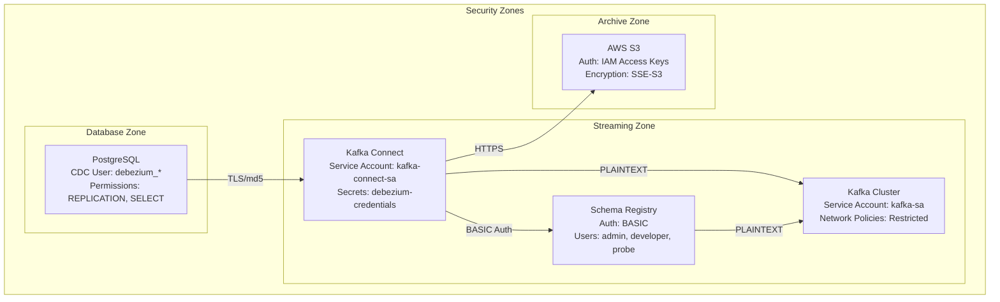

# Task 13: Data-Ingestion-Specific Security Procedures

## Overview

This document provides comprehensive security procedures for the data ingestion pipeline, focusing on credential rotation, access validation, and compliance requirements. The procedures are designed for the PostgreSQL → Debezium CDC → Kafka → S3 pipeline running on Kind Kubernetes with 6Gi RAM constraints.

## Table of Contents

1. [Security Architecture](#security-architecture)
2. [Credential Rotation Procedures](#credential-rotation-procedures)
3. [Access Control Validation](#access-control-validation)
4. [Compliance Requirements](#compliance-requirements)
5. [Emergency Procedures](#emergency-procedures)
6. [Monitoring and Alerting](#monitoring-and-alerting)
7. [Troubleshooting Guide](#troubleshooting-guide)

## Security Architecture

### Components and Security Boundaries



### Security Principles

1. **Least Privilege**: Each component has minimal required permissions
2. **Defense in Depth**: Multiple security layers (network, authentication, authorization)
3. **Zero-Downtime Rotation**: Credential changes without service interruption
4. **Audit Trail**: All security operations are logged and traceable
5. **Fail-Safe**: Security failures result in service shutdown, not bypass

## Credential Rotation Procedures

### 1. PostgreSQL CDC User Rotation

#### Overview
Rotate PostgreSQL CDC user credentials while maintaining replication slot continuity to prevent data loss.

#### Prerequisites
- PostgreSQL 14+ (for native slot ownership transfer)
- Active replication slot: `debezium_slot`
- CDC lag < 30 seconds
- Available memory > 20%

#### Procedure

```bash
# 1. Execute rotation script
./task13-credential-rotation.sh --component postgresql

# 2. Monitor rotation progress
tail -f /tmp/task13-rotation-*.log

# 3. Validate CDC functionality
./task13-access-validation.sh --component postgresql
```

#### Detailed Steps

1. **Pre-flight Validation**
   ```sql
   -- Check replication slot status
   SELECT slot_name, active, confirmed_flush_lsn, 
          pg_size_pretty(pg_wal_lsn_diff(pg_current_wal_lsn(), confirmed_flush_lsn)) as lag
   FROM pg_replication_slots 
   WHERE slot_name = 'debezium_slot';
   ```

2. **Create New CDC User**
   ```sql
   CREATE USER debezium_20240115_1030 WITH REPLICATION PASSWORD 'secure_generated_password' IN ROLE debezium_parent; 
   ALTER ROLE debezium_20240115_1030 SET ROLE debezium_parent;
   ```

3. **Pause Connector and Transfer Slot**
   ```bash
   # Pause connector
   curl -X PUT http://kafka-connect:8083/connectors/postgres-cdc-users-connector/pause
   
   # Transfer slot ownership (PostgreSQL 14+)
   ALTER REPLICATION SLOT debezium_slot OWNER TO debezium_20240115_1030;
   ```

4. **Update Kubernetes Secrets**
   ```bash
   kubectl patch secret debezium-credentials -n data-ingestion \
     --patch='{"data":{"db-username":"'$(echo -n "debezium_20240115_1030" | base64 -w 0)'","db-password":"'$(echo -n "secure_generated_password" | base64 -w 0)'"}}'
   ```

5. **Delete Pod to Restart and Resume**
   ```bash
   # Restart Kafka Connect
   kubectl delete pod -l app=kafka-connect,component=worker -n data-ingestion
   kubectl wait --for=condition=ready pod -l app=kafka-connect,component=worker -n data-ingestion --timeout=300s
   
   # Resume connector
   curl -X PUT http://kafka-connect:8083/connectors/postgres-cdc-users-connector/resume
   ```

6. **Validation and Cleanup**
   ```bash
   # Validate CDC is working
   ./task13-access-validation.sh --component postgresql
   
   # Schedule old user cleanup (after 24-hour validation period)
   echo "DROP USER debezium_old;" > /tmp/cleanup-$(date +%Y%m%d).sql
   ```

#### Rollback Procedure

If rotation fails:

1. **Immediate Rollback**
   ```bash
   # Restore from backup secret
   kubectl get secret debezium-credentials-backup -n data-ingestion -o yaml | \
     sed 's/debezium-credentials-backup/debezium-credentials/' | \
     kubectl apply -f -
   
   # Restart Kafka Connect
   kubectl delete pod -l app=kafka-connect,component=worker -n data-ingestion
   kubectl wait --for=condition=ready pod -l app=kafka-connect,component=worker -n data-ingestion --timeout=300s
   ```

### 2. Schema Registry Credential Rotation

#### Overview
Three-phase rotation to ensure all clients can authenticate during transition.

#### Procedure

1. **Phase 1: Add New Credentials**
   ```bash
   # Update schema-registry-auth with new admin credentials
   local old_user_info=$(kubectl get secret schema-registry-auth -n data-ingestion -o yaml | yq 'select(.metadata.name == "schema-registry-auth").data.user-info' | base64 -d)
   local new_user_info=$(echo "$old_user_info" | sed "s/admin:.*/admin:new_admin_password,admin/")
   new_user_info="${new_user_info//$'\n'/\\n}"
   kubectl patch secret schema-registry-auth -n data-ingestion \
        --patch="{\"stringData\":{\"user-info\":\"$new_user_info\",\"admin-password\":\"new_admin_password\"}}"
   ```

2. **Phase 2: Update Clients**
   ```bash  
   # Restart Schema Registry and Kafka Connect
   kubectl delete pod -l app=schema-registry,component=schema-management -n data-ingestion
   kubectl wait --for=condition=ready pod -l app=schema-registry,component=schema-management -n data-ingestion --timeout=300s
   kubectl delete pod -l app=kafka-connect,component=worker -n data-ingestion
   kubectl wait --for=condition=ready pod -l app=kafka-connect,component=worker -n data-ingestion --timeout=300s
   ```

## Access Control Validation

### Automated Validation

Use the provided validation script to verify access controls:

```bash
# Validate all components
./task13-access-validation.sh --component all --verbose

# Validate specific component
./task13-access-validation.sh --component postgresql
./task13-access-validation.sh --component kafka-connect
./task13-access-validation.sh --component schema-registry
./task13-access-validation.sh --component s3
```

### Manual Validation Checklist

#### PostgreSQL CDC User
- [ ] User exists and has REPLICATION privilege
- [ ] User has SELECT permissions on all required tables
- [ ] Replication slot is active and owned by CDC user
- [ ] WAL level is set to 'logical'
- [ ] Max replication slots >= 4

#### Kafka Connect
- [ ] Service is accessible and running
- [ ] Required connector plugins are installed
- [ ] Debezium connector is in RUNNING state
- [ ] Connector tasks are in RUNNING state
- [ ] Can connect to PostgreSQL, Kafka, and Schema Registry

#### Schema Registry
- [ ] Service is accessible and running
- [ ] Authentication is working
- [ ] Compatibility level is set to BACKWARD
- [ ] Can connect to Kafka cluster
- [ ] Subjects are being registered correctly

#### AWS S3
- [ ] AWS credentials are configured
- [ ] Can list S3 bucket contents
- [ ] S3 Sink connector is running (if deployed)
- [ ] Files are being written to S3 with correct partitioning

#### Network Security
- [ ] Network policies are enforced
- [ ] Inter-service connectivity is working
- [ ] External access is properly restricted
- [ ] DNS resolution is working

#### Kubernetes RBAC
- [ ] Service accounts exist
- [ ] Required secrets are present
- [ ] Network policies are configured
- [ ] Pod security contexts are enforced

## Compliance Requirements

### Data Protection Compliance

#### GDPR/Privacy Requirements
- **Data Minimization**: Only necessary data fields are captured in CDC
- **Encryption in Transit**: All data transmission uses TLS/HTTPS
- **Encryption at Rest**: S3 objects use SSE-S3 encryption
- **Access Logging**: All data access is logged and auditable
- **Right to be Forgotten**: Procedures for data deletion in S3 archives

#### SOC 2 Type II Requirements
- **Access Controls**: Least privilege access implemented
- **Change Management**: All credential rotations are documented
- **Monitoring**: Continuous monitoring of access patterns
- **Incident Response**: Procedures for security incidents
- **Backup and Recovery**: Secure backup of configuration and secrets

### Security Standards Compliance

#### CIS Kubernetes Benchmark
- [ ] Pod Security Standards enforced (Baseline level)
- [ ] Network policies implemented
- [ ] RBAC configured with least privilege
- [ ] Secrets management using Kubernetes secrets
- [ ] Container images scanned for vulnerabilities

#### NIST Cybersecurity Framework
- **Identify**: Asset inventory and risk assessment
- **Protect**: Access controls and data protection
- **Detect**: Monitoring and alerting
- **Respond**: Incident response procedures
- **Recover**: Backup and recovery procedures

### Audit Requirements

#### Audit Log Requirements
- All credential rotations must be logged
- Access attempts (successful and failed) must be recorded
- Configuration changes must be tracked
- Data access patterns must be monitored

#### Audit Trail Format
```json
{
  "timestamp": "2024-01-15T10:30:00Z",
  "event_type": "credential_rotation",
  "component": "postgresql_cdc",
  "user": "admin",
  "action": "rotate_credentials",
  "old_user": "debezium_20240114_1500",
  "new_user": "debezium_20240115_1030",
  "status": "success",
  "validation_status": "passed",
  "rollback_available": true
}
```

## Emergency Procedures

### Security Incident Response

#### Suspected Credential Compromise

1. **Immediate Actions**
   ```bash
   # Immediately rotate all credentials
   ./task13-credential-rotation.sh --component all
   
   # Check for unauthorized access
   ./task13-access-validation.sh --component all
   
   # Review audit logs
   kubectl logs -n data-ingestion -l app=kafka-connect --since=24h | grep -i "auth\|error\|fail"
   ```

2. **Investigation**
   - Review Kubernetes audit logs
   - Check PostgreSQL connection logs
   - Analyze Kafka Connect logs for authentication failures
   - Review AWS CloudTrail logs for S3 access

3. **Recovery**
   - Rotate all credentials using emergency procedures
   - Update monitoring alerts
   - Document incident and lessons learned

#### Service Compromise

1. **Isolation**
   ```bash
   # Isolate compromised service
   kubectl scale deployment/[compromised-service] --replicas=0 -n data-ingestion
   
   # Apply emergency network policies
   kubectl apply -f emergency-network-policy.yaml
   ```

2. **Assessment**
   - Determine scope of compromise
   - Check data integrity
   - Verify backup availability

3. **Recovery**
   - Redeploy service from known-good configuration
   - Restore data from backups if necessary
   - Implement additional security controls

### Disaster Recovery

#### Complete Environment Recovery

1. **Prerequisites**
   - Kind cluster backup available
   - Configuration files in version control
   - Secrets backup available (encrypted)

2. **Recovery Steps**
   ```bash
   # Recreate Kind cluster, apply configurations, deploy services
   ./deploy-pipeline.sh
   
   # Validate recovery
   ./task13-access-validation.sh --component all
   ```

## Monitoring and Alerting

### Security Metrics

#### Key Performance Indicators (KPIs)
- Credential rotation frequency (target: monthly)
- Failed authentication attempts (threshold: >10/hour)
- Unauthorized access attempts (threshold: >0)
- Security validation success rate (target: >95%)

#### Monitoring Queries

```bash
# Check CDC lag (should be < 30 seconds)
kubectl exec -n data-ingestion postgresql-0 -- psql -U postgres -d ecommerce -c "
SELECT slot_name, 
       EXTRACT(EPOCH FROM (now() - confirmed_flush_lsn::text::timestamp)) as lag_seconds
FROM pg_replication_slots 
WHERE slot_name = 'debezium_slot';"

# Check connector status
curl -s http://kafka-connect:8083/connectors/postgres-cdc-users-connector/status | jq '.connector.state'

# Check authentication failures
kubectl logs -n data-ingestion -l app=kafka-connect --since=1h | grep -c "authentication failed"
```

### Alert Definitions

#### Critical Alerts
- **Replication Slot Inactive**: CDC replication slot becomes inactive
- **Connector Failed**: Debezium or S3 Sink connector fails
- **Authentication Failures**: Multiple authentication failures detected
- **Credential Rotation Overdue**: Credentials not rotated within policy timeframe

#### Warning Alerts
- **High CDC Lag**: Replication lag exceeds 30 seconds
- **Low Memory**: Available memory below 20%
- **Schema Registry Unavailable**: Schema Registry not responding
- **S3 Access Issues**: S3 operations failing

### Alert Configuration

```yaml
# Example Prometheus alert rules
groups:
- name: data-ingestion-security
  rules:
  - alert: CDCReplicationSlotInactive
    expr: pg_replication_slot_active{slot_name="debezium_slot"} == 0
    for: 1m
    labels:
      severity: critical
    annotations:
      summary: "CDC replication slot is inactive"
      description: "The Debezium replication slot has been inactive for more than 1 minute"
  
  - alert: ConnectorFailed
    expr: kafka_connect_connector_status{connector="postgres-cdc-users-connector"} != 1
    for: 2m
    labels:
      severity: critical
    annotations:
      summary: "Kafka Connect connector failed"
      description: "The {{ $labels.connector }} connector has been in failed state for more than 2 minutes"
```

## Troubleshooting Guide

### Common Issues and Solutions

#### 1. Replication Slot Transfer Fails

**Symptoms:**
- Connector resumes but no new events are processed
- PostgreSQL logs show "permission denied" errors
- Replication slot shows as inactive

**Diagnosis:**
```sql
-- Check slot ownership
SELECT slot_name, active, owner FROM pg_replication_slots WHERE slot_name = 'debezium_slot';

-- Check user permissions
SELECT rolname, rolreplication FROM pg_roles WHERE rolname LIKE 'debezium%';
```

**Solution:**
```bash
# Let Debezium recreate the slot from stored offsets
curl -X DELETE http://kafka-connect:8083/connectors/postgres-cdc-users-connector
# Redeploy connector - it will resume from last committed offset
```

#### 2. Memory Issues During Rotation

**Symptoms:**
- Pod restarts fail with OOMKilled
- Cluster becomes unresponsive
- Services fail to start after rotation

**Diagnosis:**
```bash
# Check memory usage
kubectl top nodes
kubectl top pods -n data-ingestion

# Check for memory limits
kubectl describe pod -n data-ingestion -l app=kafka-connect
```

**Solution:**
```bash
# Sequential restarts instead of parallel
kubectl delete pod -l app=schema-registry,component=schema-management -n data-ingestion
kubectl wait --for=condition=ready pod -l app=schema-registry,component=schema-management -n data-ingestion --timeout=300s

# Wait for memory to stabilize
sleep 30

kubectl delete pod -l app=kafka-connect,component=worker -n data-ingestion
kubectl wait --for=condition=ready pod -l app=kafka-connect,component=worker -n data-ingestion --timeout=300s
```

#### 3. Schema Registry Authentication Issues

**Symptoms:**
- Kafka Connect cannot register schemas
- 401 Unauthorized errors in logs
- Connector tasks fail with schema errors

**Diagnosis:**
```bash
# Test Schema Registry authentication
curl -u admin:password http://schema-registry:8081/subjects

# Check Kafka Connect configuration
kubectl exec -n data-ingestion deployment/kafka-connect -- env | grep SCHEMA
```

**Solution:**
```bash
# Verify credentials match
kubectl get secret schema-registry-auth -n data-ingestion -o yaml | grep admin

# Update credentials if needed
kubectl patch secret schema-registry-auth -n data-ingestion \
  --patch='{"data":{"admin-user":"'$(echo -n "admin" | base64 -w 0)'","admin-password":"'$(echo -n "correct_password" | base64 -w 0)'"}}'
```

#### 4. S3 Access Denied

**Symptoms:**
- S3 Sink connector fails
- AWS access denied errors in logs
- No files appearing in S3 bucket

**Diagnosis:**
```bash
# Test AWS credentials
kubectl exec -n data-ingestion deployment/kafka-connect -- aws sts get-caller-identity

# Test S3 bucket access
kubectl exec -n data-ingestion deployment/kafka-connect -- aws s3 ls s3://data-s3-bucket/
```

**Solution:**
```bash
# Verify IAM policy allows required actions
aws iam get-user-policy --user-name datapipe-s3-user --policy-name S3AccessPolicy

# Update credentials if needed
kubectl patch secret aws-credentials -n data-ingestion \
  --patch='{"data":{"access-key-id":"'$(echo -n "new_key" | base64 -w 0)'","secret-access-key":"'$(echo -n "new_secret" | base64 -w 0)'"}}'
```

### Diagnostic Commands

#### Health Check Commands
```bash
# Overall system health
kubectl get pods -n data-ingestion
kubectl get services -n data-ingestion
kubectl get secrets -n data-ingestion

# Component-specific health
curl -s http://kafka-connect:8083/ | jq .
curl -s http://schema-registry:8081/subjects
kubectl exec -n data-ingestion postgresql-0 -- pg_isready

# Network connectivity
kubectl exec -n data-ingestion deployment/kafka-connect -- nc -zv postgresql 5432
kubectl exec -n data-ingestion deployment/kafka-connect -- nc -zv kafka-headless 9092
kubectl exec -n data-ingestion deployment/kafka-connect -- nc -zv schema-registry 8081
```

#### Log Analysis Commands
```bash
# Recent errors across all components
kubectl logs -n data-ingestion -l app=postgresql --since=1h | grep -i error
kubectl logs -n data-ingestion -l app=kafka-connect --since=1h | grep -i error
kubectl logs -n data-ingestion -l app=schema-registry --since=1h | grep -i error

# Authentication-related logs
kubectl logs -n data-ingestion -l app=kafka-connect --since=1h | grep -i "auth\|credential\|permission"

# CDC-specific logs
kubectl logs -n data-ingestion -l app=kafka-connect --since=1h | grep -i "debezium\|replication\|slot"
```

## Maintenance Schedule

### Regular Maintenance Tasks

#### Daily
- [ ] Monitor security alerts
- [ ] Check service health status
- [ ] Review authentication logs

#### Weekly
- [ ] Run access validation script
- [ ] Review security metrics
- [ ] Check for security updates

#### Monthly
- [ ] Rotate PostgreSQL CDC user credentials
- [ ] Rotate Schema Registry credentials
- [ ] Review and update network policies
- [ ] Conduct security assessment

#### Quarterly
- [ ] Rotate AWS S3 access keys
- [ ] Review and update security procedures
- [ ] Conduct disaster recovery test
- [ ] Security compliance audit

### Maintenance Windows

#### Planned Maintenance
- **Schedule**: First Sunday of each month, 02:00-04:00 UTC
- **Duration**: Maximum 2 hours
- **Activities**: Credential rotation, security updates, validation

#### Emergency Maintenance
- **Trigger**: Security incident or critical vulnerability
- **Response Time**: Within 1 hour of detection
- **Activities**: Immediate credential rotation, system isolation, recovery

---

## Document Information

- **Version**: 1.0
- **Last Updated**: 2024-01-15
- **Next Review**: 2024-04-15
- **Owner**: Data Engineering Team
- **Approver**: Security Team

## Change Log

| Version | Date | Changes | Author |
|---------|------|---------|--------|
| 1.0 | 2024-01-15 | Initial version | Task 13 Implementation |

---

*This document is part of the data-ingestion-pipeline security procedures and should be reviewed quarterly or after any security incidents.*