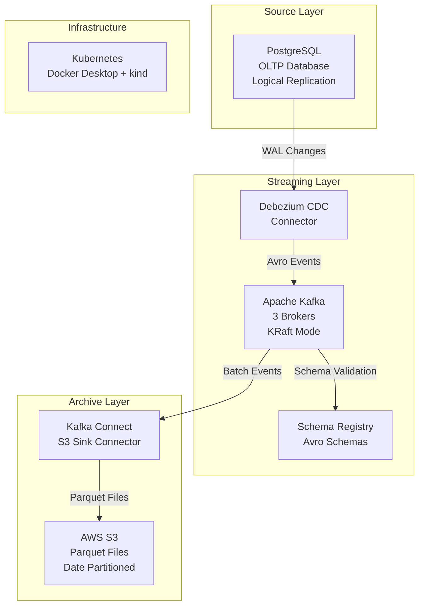

# DataPipe: High-Throughput Data Ingestion Pipeline


DataPipe is an end-to-end data pipeline demonstrating a Lambda Architecture for high-volume data processing. This repository contains the first major component: a high-throughput, resilient data ingestion pipeline designed for local development and testing.

It captures real-time changes from a PostgreSQL database using Debezium CDC, streams them through a highly-available Kafka cluster, and reliably archives them to AWS S3 in Parquet format. The entire stack is orchestrated on Kubernetes (via `kind`) and is meticulously engineered to operate within a strict 4GB RAM budget.

## ✨ Features

-   **Real-time CDC Streaming**: Captures database changes from PostgreSQL using Debezium and streams them through a high-availability, KRaft-based Kafka cluster.
-   **Managed Schema Evolution**: Employs Confluent Schema Registry with Avro to enforce data contracts and handle schema changes without breaking the pipeline.
-   **Optimized S3 Archival**: Archives the event stream to AWS S3 as compressed Parquet files, partitioned by time (`year/month/day/hour`) for efficient analytical queries.
-   **Kubernetes-Native Deployment**: Defined entirely with Kubernetes manifests for reproducible, production-parity deployment on a local `kind` cluster.
-   **Resource-Efficient**: Meticulously configured to run the complete pipeline—PostgreSQL, Kafka, and Connect—within a **4GB RAM** budget.
-   **Secure by Design**: Enforces strict service-to-service communication with Network Policies and follows the principle of least privilege with RBAC.

## 🏗️ Architecture

The pipeline follows a classic three-layer event-driven architecture: Source, Streaming, and Archive.



### Data Flow

1.  **PostgreSQL**: An application performs transactions on the e-commerce database tables (`users`, `products`, `orders`).
2.  **Debezium CDC**: The Debezium PostgreSQL connector, running on Kafka Connect, tails the PostgreSQL Write-Ahead Log (WAL) via logical replication. It captures row-level changes and converts them into structured Avro events.
3.  **Schema Registry**: As events are produced, their Avro schemas are registered and validated against the Schema Registry, ensuring data contract compliance.
4.  **Apache Kafka**: Change events are published to corresponding Kafka topics (e.g., `postgres.public.users`). The 3-broker cluster provides high availability and data durability.
5.  **S3 Sink Connector**: The S3 Sink connector consumes messages from the Kafka topics, batches them by record count or time, converts them to Parquet format, and writes them to an AWS S3 bucket.
6.  **AWS S3**: The final, immutable data lands in S3, partitioned by time and ready for consumption by batch processing frameworks, data lakes, or analytics tools.

## 💻 Technology Stack

| Component             | Technology                                                                                                    | Purpose                                       |
| --------------------- | ------------------------------------------------------------------------------------------------------------- | --------------------------------------------- |
| **Orchestration**     | [Kubernetes (Kind)](https://kind.sigs.k8s.io/)                                                                | Container orchestration for local development |
| **Database (Source)** | [PostgreSQL](https://www.postgresql.org/)                                                                     | OLTP database and CDC source                  |
| **Streaming**         | [Apache Kafka (KRaft)](https://kafka.apache.org/)                                                             | Distributed event streaming platform          |
| **CDC**               | [Debezium](https://debezium.io/)                                                                              | Real-time change data capture                 |
| **Schema Management** | [Confluent Schema Registry](https://docs.confluent.io/platform/current/schema-registry/index.html)            | Avro schema management and evolution          |
| **Integration**       | [Kafka Connect](https://docs.confluent.io/platform/current/connect/index.html)                                | Framework for scalable data streaming         |
| **Storage (Archive)** | [AWS S3](https://aws.amazon.com/s3/)                                                                          | Durable, long-term object storage             |
| **Data Format**       | [Apache Parquet](https://parquet.apache.org/)                                                                 | Columnar storage format for analytics         |
| **Schema Format**     | [Apache Avro](https://avro.apache.org/)                                                                       | Data serialization format with schemas        |
| **Deployment**        | [Bash](https://www.gnu.org/software/bash/), [Python](https://www.python.org/)                                  | Automation and data generation scripts        |

## 📊 Project Status

The project is being implemented in phases.

-   **✅ Phase 1: Foundation**: Infrastructure setup, including Kind cluster, persistent volumes, namespaces, and PostgreSQL deployment.
-   **✅ Phase 2: Core Services**: Deployment of the 3-broker Kafka cluster, Schema Registry, and the Kafka Connect framework.
-   **✅ Phase 3: Integration**: Configuration of the Debezium and S3 Sink connectors to establish the end-to-end data flow.
-   **🚧 Phase 4: Production Readiness (In Progress)**: Implementation of security procedures, backup/recovery plans, and full-scale performance testing.

## ⚙️ Resource Allocation (4Gi Constraint)

The entire data ingestion pipeline is designed to run within a **4Gi RAM** limit, making it ideal for local development on standard personal computers.

| Service           | Requested Memory | CPU Request/Limit | Storage |
| ----------------- | ---------------- | ----------------- | ------- |
| PostgreSQL        | `512Mi`          | `500m` / `1`      | `5Gi`   |
| Kafka Cluster (3) | `1.5Gi` (total)  | `750m` / `1.5`    | `10Gi`  |
| Schema Registry   | `384Mi`          | `250m` / `500m`   | -       |
| Kafka Connect     | `1Gi`            | `500m` / `1`      | -       |
| **Total**         | **~3.4Gi**       | **~2 / 4**        | **15Gi**  |

## 🚀 Getting Started

### Prerequisites

-   [Docker Desktop](https://www.docker.com/products/docker-desktop/) for Windows/macOS with Kubernetes enabled.
-   [kind](https://kind.sigs.k8s.io/docs/user/quick-start/#installation) (Kubernetes in Docker).
-   [kubectl](https://kubernetes.io/docs/tasks/tools/install-kubectl/) configured to interact with your Docker cluster.
-   An AWS account with an S3 bucket and IAM credentials (`access key id` and `secret access key`).

### Deployment

1.  **Clone the Repository**
    ```sh
    git clone <your-repo-url>
    cd DataPipe
    ```

2.  **Configure Secrets**
    The pipeline requires credentials for PostgreSQL, AWS, and Schema Registry. Copy the example file and fill in your details.
    ```sh
    cp 04-secrets.yaml.example 04-secrets.yaml
    ```
    Edit `04-secrets.yaml` and provide **base64 encoded** values for:
    -   `aws-credentials`: Your AWS `access-key-id`, `secret-access-key`, `region`, and `s3-bucket` name.
    -   Other secrets can be left as default for local development.

3.  **Deploy the Pipeline**
    The `deploy-data-ingestion-pipeline.sh` script automates the entire setup process.
    ```sh
    ./deploy-data-ingestion-pipeline.sh
    ```
    This script will:
    -   Create a 3-node `kind` Kubernetes cluster.
    -   Install the Kubernetes Metrics Server.
    -   Apply all Kubernetes manifests for namespaces, services, storage, and applications in the correct order.
    -   Wait for each component to become ready before proceeding to the next.
    -   Deploy the Debezium and S3 Sink connector configurations to Kafka Connect.
    -   Run a performance test using `data-generator.py` to simulate a workload.

### Verifying the Pipeline

-   **Check Pod Status**: Ensure all pods in the `data-ingestion` namespace are `Running` or `Completed`.
    ```sh
    kubectl get pods -n data-ingestion
    ```
-   **Check Connectors**: Verify that both connectors are in a `RUNNING` state.
    ```sh
    kubectl exec -n data-ingestion deploy/kafka-connect -- curl -s http://localhost:8083/connectors | jq .
    ```
-   **Check S3 Bucket**: After the data generator runs, navigate to your S3 bucket. You should see new objects organized in a `year=.../month=.../day=.../hour=...` directory structure.

## 📂 Project Structure

The repository is organized to separate Kubernetes manifests, connector configurations, automation scripts, and design documents.

```txt
DataPipe
├── .kiro/specs/                         # Project Design, Requirements, and Tasks
├── 01-namespace.yaml                    # Kubernetes Namespace and Resource Quotas
├── 02-service-accounts.yaml             # RBAC Service Accounts, Roles, and Bindings
├── 03-network-policies.yaml             # Network isolation rules for all components
├── 04-secrets.yaml.example              # Template for secrets
├── data-generator.py                    # Performance test data generator
├── deploy-data-ingestion-pipeline.sh    # Main deployment automation script
├── kind-config.yaml                     # 3-node Kind cluster definition
├── storage-classes.yaml                 # Differentiated storage for DB vs. streaming
├── *.json                               # Kafka Connect connector configurations
└── task*.yaml                           # Kubernetes manifests for each pipeline component
```

## 🗺️ Future Work & Roadmap

This repository represents the foundational ingestion layer. The broader vision includes:

-   **Performance Tuning**: Scale and tune the pipeline to consistently achieve the 10,000 events/sec target.
-   **Speed Layer**: Integrate Apache Spark Streaming to consume data from Kafka for real-time analytics.
-   **Batch Layer**: Use dbt Core and Snowflake to process the Parquet data in S3 for BI and reporting.
-   **Data Lakehouse**: Evolve the S3 storage layer into an Apache Iceberg table for transactional capabilities.
-   **Orchestration**: Introduce Airflow to manage complex, scheduled workflows across the batch and speed layers.

## 📄 License

This project is licensed under the MIT License - see the [LICENSE](LICENSE) file for details.