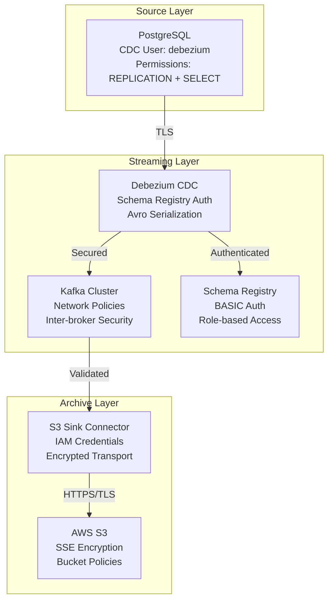

# Data Pipeline Security Runbook

## Overview

This runbook provides comprehensive security procedures for the data ingestion pipeline (PostgreSQL → Debezium CDC → Kafka → S3). It covers operational security procedures, incident response, and compliance requirements specific to data pipeline security.

**Pipeline Components:**
- PostgreSQL (CDC source)
- Debezium CDC Connector
- Apache Kafka (3-broker cluster)
- Confluent Schema Registry
- Kafka Connect S3 Sink
- AWS S3 (archival storage)

**Environment:** Kubernetes (Kind cluster), 4Gi RAM constraint, local development

## Security Architecture

### Data Flow Security



### Security Controls Matrix

| Component | Authentication | Authorization | Encryption | Network |
|-----------|---------------|---------------|------------|---------|
| PostgreSQL | md5 password | REPLICATION + SELECT on specific tables | SSL required | Network policies |
| Kafka | PLAINTEXT (dev) | Topic-level ACLs | In-transit TLS (prod) | Pod-to-pod isolation |
| Schema Registry | BASIC auth | Role-based (admin/developer/readonly) | HTTPS | Ingress restrictions |
| S3 | IAM access keys | Bucket policies (least privilege) | SSE-S3/SSE-KMS | HTTPS only |
| Kubernetes | Service accounts | RBAC roles | Pod security contexts | Network policies |

## Operational Procedures

### Daily Security Checks

**Automated (via CronJob):**
```bash
# Run daily security audit
kubectl apply -f task13-security-audit-job.yaml

# Check audit results
kubectl logs -n data-ingestion job/data-pipeline-security-audit
```

**Manual Verification:**
1. **CDC User Permissions:**
   ```bash
   ./task13-validate-cdc-permissions.sh
   ```

2. **S3 Bucket Policies:**
   ```bash
   ./task13-audit-s3-policies.sh
   ```

3. **Network Isolation:**
   ```bash
   ./task13-network-policy-validation.sh
   ```

4. **RBAC Compliance:**
   ```bash
   ./task13-rbac-audit.sh
   ```

### Weekly Security Reviews

**Every Monday:**
1. Review security audit reports from the past week
2. Check for failed credential rotations
3. Validate network policy effectiveness
4. Review S3 access logs for anomalies
5. Update security documentation if needed

**Checklist:**
- [ ] All security audit jobs completed successfully
- [ ] No excessive permissions detected
- [ ] Network policies blocking unauthorized traffic
- [ ] S3 bucket policies follow least privilege
- [ ] No pods using default service account
- [ ] All credentials within rotation schedule

### Monthly Security Assessment

**First Monday of each month:**
1. Comprehensive security review
2. Update threat model if architecture changes
3. Review and update incident response procedures
4. Validate backup and recovery procedures
5. Security training review for team members

## Credential Management

### Current Credentials

| Credential Type | Location | Rotation Schedule | Owner |
|----------------|----------|-------------------|-------|
| PostgreSQL CDC User | Kubernetes Secret | 90 days (dev), 30 days (prod) | Data Team |
| Schema Registry Auth | Kubernetes Secret | 90 days | Data Team |
| S3 Access Keys | Kubernetes Secret | 60 days | DevOps Team |
| Service Account Tokens | Kubernetes (auto) | 1 year (auto-rotation) | Platform Team |

### Credential Rotation Procedures

**PostgreSQL CDC User:**
1. Generate new password using secure random generator
2. Update PostgreSQL user password
3. Update Kubernetes secret
4. Restart Debezium connector pods
5. Verify CDC functionality
6. Remove old password after 24-hour grace period

**Schema Registry Credentials:**
1. Generate new username/password pair
2. Update Schema Registry user configuration
3. Update all connector configurations
4. Rolling restart of Kafka Connect cluster
5. Verify schema operations
6. Remove old credentials

**S3 Access Keys:**
1. Create new IAM access key pair
2. Update Kubernetes secret with new keys
3. Test S3 connectivity with new keys
4. Rolling restart of S3 Sink connector
5. Verify S3 archival functionality
6. Deactivate old access keys after verification

### Emergency Credential Rotation

**When to perform emergency rotation:**
- Suspected credential compromise
- Security incident involving data access
- Departure of team member with access
- Compliance requirement or audit finding

**Emergency procedure:**
1. **Immediate:** Disable/revoke compromised credentials
2. **Within 1 hour:** Generate and deploy new credentials
3. **Within 4 hours:** Verify all services operational
4. **Within 24 hours:** Complete incident documentation
5. **Within 1 week:** Review and improve security controls

## Access Control

### Service Account Permissions

**kafka-connect-sa:**
```yaml
permissions:
  - secrets: [get, list, watch]
  - configmaps: [get, list, watch]
  - pods: [get, list]
justification: "Needed for connector configuration and secret access"
```

**postgresql-sa:**
```yaml
permissions: []
automountServiceAccountToken: false
justification: "PostgreSQL doesn't need Kubernetes API access"
```

**schema-registry-sa:**
```yaml
permissions:
  - configmaps: [get, list, watch]
justification: "Needed for configuration management"
```

### Network Security

**Default Policy:** Deny all traffic by default

**Allowed Connections:**
- Kafka Connect → PostgreSQL (port 5432)
- Kafka Connect → Kafka (port 9092)
- Kafka Connect → Schema Registry (port 8081)
- Kafka Connect → S3 (port 443, HTTPS only)
- Schema Registry → Kafka (port 9092)
- All pods → DNS (port 53)

**Blocked Connections:**
- Inter-pod communication (except explicitly allowed)
- External access (except S3 for archival)
- Cross-namespace communication
- Direct access to PostgreSQL from external sources

## Monitoring and Alerting

### Security Metrics

**Key Performance Indicators:**
- Failed authentication attempts per hour
- Credential rotation success rate
- Network policy violation attempts
- Unauthorized S3 access attempts
- Service account privilege escalation attempts

**Alert Thresholds:**
- Failed auth attempts: >10 per hour
- Credential rotation failures: Any failure
- Network policy violations: >5 per hour
- S3 access errors: >50 per hour
- RBAC violations: Any violation

### Log Analysis

**Security-relevant logs:**
1. **PostgreSQL:** Authentication failures, replication errors
2. **Kafka:** Authentication/authorization failures, topic access
3. **Schema Registry:** Authentication failures, schema access
4. **S3:** Access denied errors, unusual access patterns
5. **Kubernetes:** RBAC violations, pod security violations

**Log retention:**
- Security logs: 90 days minimum
- Audit logs: 1 year minimum
- Compliance logs: As required by regulations

## Compliance and Auditing

### Requirement 7.4 Compliance

**Credential Rotation Support:**
- ✅ Automated rotation procedures implemented
- ✅ Zero-downtime rotation capability
- ✅ Audit trail for all rotations
- ✅ Emergency rotation procedures
- ✅ Documentation and training materials

**Evidence Collection:**
- Rotation logs and timestamps
- Security audit reports
- Access control matrices
- Network policy configurations
- Incident response records

### Audit Procedures

**Monthly Internal Audit:**
1. Run comprehensive security audit scripts
2. Review access control configurations
3. Validate network policy effectiveness
4. Check credential rotation compliance
5. Document findings and remediation actions

**Quarterly External Audit:**
1. Provide security documentation
2. Demonstrate security controls
3. Review incident response procedures
4. Validate compliance with requirements
5. Implement audit recommendations

## Troubleshooting

### Common Security Issues

**Issue: CDC User Permission Denied**
```bash
# Symptoms
ERROR: permission denied for replication

# Diagnosis
./task13-validate-cdc-permissions.sh

# Resolution
1. Verify user has REPLICATION permission
2. Check table-level SELECT permissions
3. Validate replication slot ownership
4. Restart Debezium connector if needed
```

**Issue: S3 Access Denied**
```bash
# Symptoms
S3SinkConnector failed with access denied

# Diagnosis
./task13-audit-s3-policies.sh

# Resolution
1. Verify IAM credentials are valid
2. Check bucket policy allows required actions
3. Validate S3 bucket exists and is accessible
4. Rotate S3 credentials if compromised
```

**Issue: Network Policy Blocking Traffic**
```bash
# Symptoms
Connection timeouts between services

# Diagnosis
./task13-network-policy-validation.sh

# Resolution
1. Check network policy configurations
2. Verify pod labels match policy selectors
3. Test connectivity between components
4. Update policies if legitimate traffic blocked
```

**Issue: RBAC Permission Denied**
```bash
# Symptoms
Kubernetes API access denied for service account

# Diagnosis
./task13-rbac-audit.sh

# Resolution
1. Verify service account exists
2. Check role bindings are correct
3. Validate role permissions are sufficient
4. Update RBAC configuration if needed
```

### Emergency Contacts

**Security Incidents:**
- Primary: Data Team Lead
- Secondary: DevOps Team Lead
- Escalation: Security Team

**Credential Compromise:**
- Immediate: Disable credentials
- Contact: Security Team
- Timeline: <1 hour response

**Data Breach:**
- Immediate: Isolate affected systems
- Contact: Security Team + Legal
- Timeline: <30 minutes response

## Security Training

### Required Training

**All Team Members:**
- Data pipeline security overview
- Incident response procedures
- Credential management best practices
- Network security principles

**Data Team:**
- Advanced CDC security configuration
- Schema Registry security management
- S3 security and access controls
- Kubernetes RBAC administration

**DevOps Team:**
- Infrastructure security hardening
- Network policy management
- Monitoring and alerting setup
- Incident response coordination

### Training Schedule

- **Initial:** Within 30 days of joining team
- **Refresher:** Every 6 months
- **Updates:** Within 30 days of procedure changes
- **Incident-based:** Within 1 week of security incidents

## Document Control

**Version:** 1.0  
**Last Updated:** 2025-01-09  
**Next Review:** 2025-04-09  
**Owner:** Data Team  
**Approver:** Security Team  

**Change History:**
- v1.0 (2025-01-09): Initial version for Task 13 implementation

**Related Documents:**
- task13-credential-rotation-procedures.md
- task13-incident-response-playbook.md
- Data Pipeline Architecture Design
- Kubernetes Security Policies